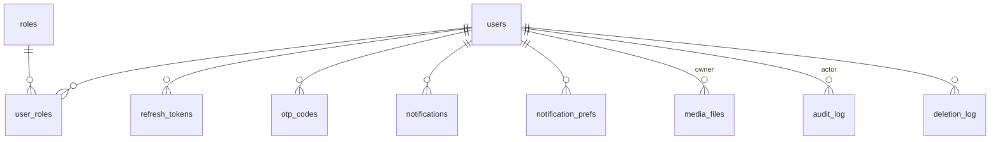
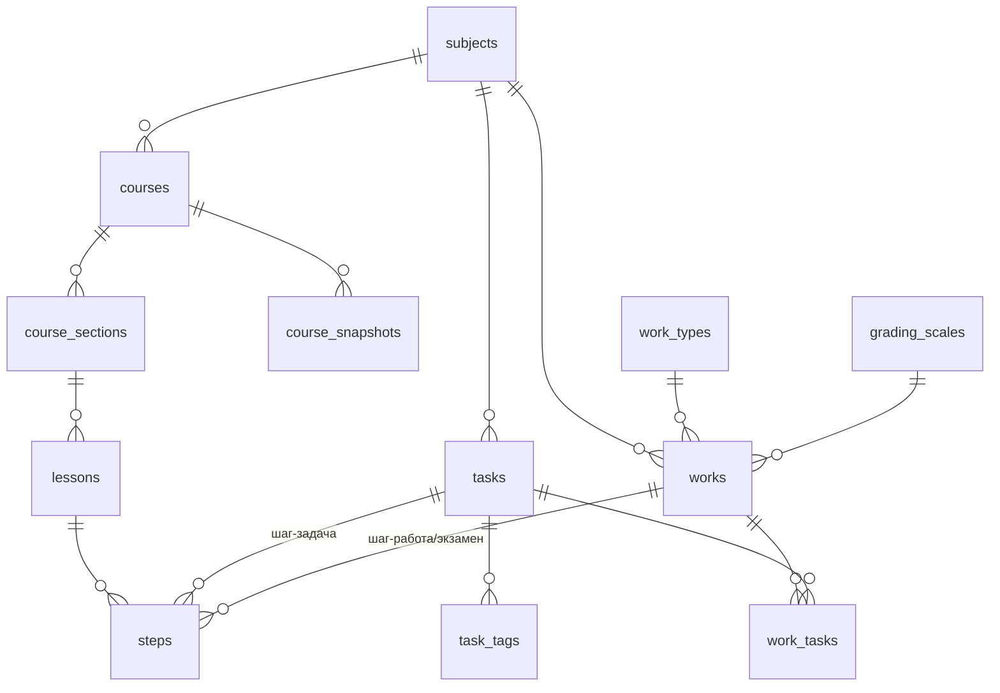
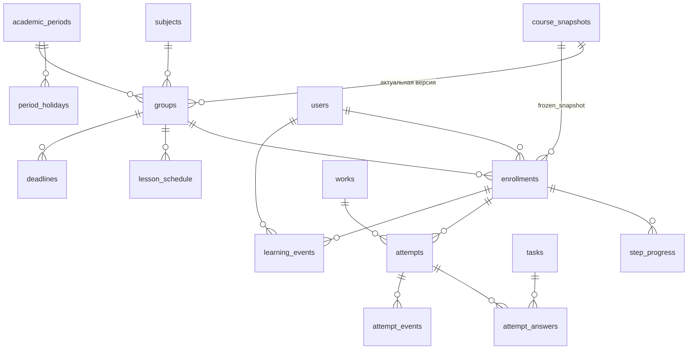
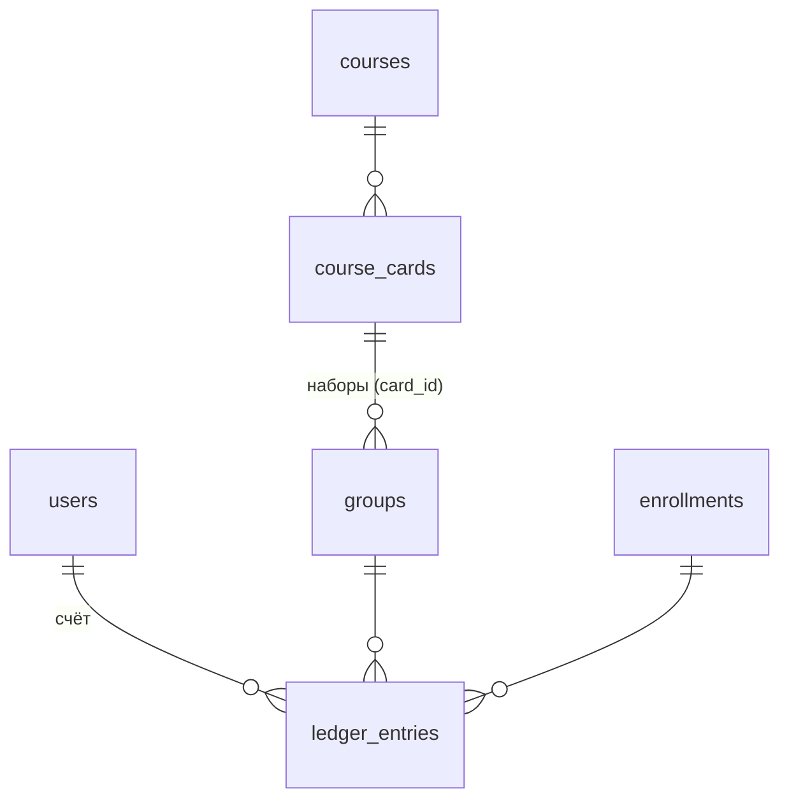

# FS-LMS 2.0 — Техническая часть (Technical Design Document)

> **Статус:** в работе. Порядок: раздел прорабатывается в обсуждении (вопросы → решения), резюме вычитывается, затем оформляется здесь. Аннотации под заголовками — рабочий план раздела, не итоговый текст; план будет уточняться.
> **Связанные документы:** `01-product.md` — продуктовая спецификация (источник требований); `03-design.md`, `04-conventions.md` — будут созданы.

---

## 0. О документе

### 0.1. Назначение и порядок ведения

- Аудитория: команда разработки (1–2 человека + AI-агенты). Документ — основной справочник при реализации.
- Границы: `01-product.md` отвечает «что и зачем», этот документ — «как устроено». Продуктовые правила не дублируются, а даются ссылками.
- Крупные решения фиксируются со статусом **принято / черновик / открытый вопрос**; у принятых — краткое обоснование и отвергнутые альтернативы.
- Разработка ведётся по **Spec-Driven Development**: код пишется только по предваряющей спецификации (эти документы — верхний уровень спецификаций; процесс и шаблон фиче-спеки — в `04-conventions.md`).

---

## План документа

### Блок I — Фундамент и модульность

#### 1. Технические цели, принципы и ограничения

> **Статус: принято** (07.08.2026).

##### 1.1. Технические цели

1. **Паритет с плагином** по реально используемым сценариям — перечень по инвентаризации, не «всё, что было».
2. **Managed-поставка**: клиент получает домен и админку; развёртывание, обновления и эксплуатация — у вендора.
3. **Комплектация только конфигурацией** инстанса; код tenant-agnostic, никаких `if client == X`.
4. **Соответствие 152-ФЗ** — обязательство продукта, а не опция.
5. **API-first как дисциплина**: весь функционал доступен только через `/api/v1`, у веб-фронтенда нет привилегированных путей; авторизация работает токенами (не только браузерной сессией). Этого достаточно для подключения мобильного клиента без переработки бэкенда; push-инфраструктуру и мобильные сценарии сейчас не проектируем.

##### 1.2. Рабочие принципы

1. **Выключенный модуль не существует в наблюдаемых поверхностях**: нет роутов API, нет экранов и пунктов меню, нет прав, нет секций настроек, код модуля не загружается браузером (ленивые чанки — §4.6). Исключения — ненаблюдаемые поверхности: БД (таблицы всех модулей создаются на каждом инстансе единой цепочкой миграций и у выключенного модуля стоят пустыми) и статика фронтенда (сборка одна на весь парк — чанки выключенного модуля лежат на nginx, но не загружаются). Обоснование: единообразный парк; даунгрейд по продукту сохраняет данные — таблицы обязаны переживать выключение модуля.
2. **Минимум сложности**: при выборе между новой абстракцией и урезанием функционала — урезание, согласованное с продуктовой частью. Абстракция появляется только под живого потребителя.
3. **Языки и i18n**: все строки интерфейса — только через слой переводов, в поставке одна локаль `ru`. Ошибки API — машиночитаемые коды, тексты к ним — словарь фронтенда. Серверные логи и служебные тексты ошибок — на английском. Тексты писем и уведомлений живут в редактируемых шаблонах инстанса (продуктовое требование), в коде не хардкодятся; уведомления колокольчика рендерит фронтенд — они в слое переводов автоматически. Переключение языков, определение локали пользователя и мультиязычный контент не строим до живого рынка №2.
4. **UI из универсальных компонентов**: единая библиотека компонентов, экраны собираются из неё; без уникальных решений под отдельные экраны.

##### 1.3. Анти-scope

Не делаем осознанно: микросервисы и брокеры сообщений; shared-DB мультитенантность (один клиент = один инстанс); конструктор страниц со свободной вёрсткой; перенос PHP/jQuery-кода; мобильное приложение сейчас; LTI/SCORM-интеграции (модель держим совместимой, реализация — под живого клиента).

##### 1.4. Технологический стек

| Слой | Выбор |
|---|---|
| Backend | Python 3.12+, FastAPI, SQLAlchemy 2.0 (async), Alembic, Pydantic v2 |
| Хранение | PostgreSQL 16+ (данные, очередь задач, pub/sub — решение §2); S3-совместимое хранилище (MinIO в dev) |
| Frontend | React + TypeScript + Vite, монорепо |
| Поставка | docker-compose на инстанс |

Частные выборы зафиксированы в профильных разделах: очередь — procrastinate (§10), публичная часть — серверный рендер (§11), UI — Mantine (§11). Полный реестр зависимостей — §1.5.

##### 1.5. Реестр зависимостей

Единственный источник версий — lockfiles (`uv.lock`, `pnpm-lock.yaml`); менеджеры пакетов: **uv** (Python), **pnpm** (Node). Правила: новая зависимость — только через PR с обоснованием; дублирующие друг друга библиотеки запрещены; реестр пополняется при появлении потребителя.

**Backend (runtime):**

| Библиотека | Зачем |
|---|---|
| fastapi + uvicorn | API и сервер (§1.4) |
| sqlalchemy 2 (async) + asyncpg + alembic | ORM, драйвер, миграции |
| pydantic v2 + pydantic-settings | схемы API, payload шагов, конфиг инстанса |
| procrastinate | очередь jobs поверх Postgres (§10) |
| structlog | JSON-логи (§18) |
| argon2-cffi | хэши паролей (§8) |
| authlib | OAuth привязки соцсетей (§8) |
| httpx | исходящие HTTP: ЮKassa (напрямую, без их синхронного SDK), SmartCaptcha, DaData |
| jinja2 | публичные страницы (§11.1), шаблоны писем (§14) |
| aiosmtplib | отправка почты через релей (§2.1) |
| cryptography | AES-GCM полей ЭДО (§15.2) |
| nh3 | серверная санитизация rich-text (§15.2) |
| pillow | превью изображений (§13) |
| aioboto3 | S3/MinIO (§13) |
| prometheus-client | метрики (§18) |
| sentry-sdk | ошибки в GlitchTip (§18) |

**Backend (dev):** pytest + pytest-asyncio + testcontainers (§20), polyfactory (фабрики тестовых данных), ruff (линт и формат), mypy, import-linter (§4.7), coverage.

**Frontend (runtime):** react + react-dom, react-router (§11.2), @tanstack/react-query, @mantine/* (core, hooks, forms, dates, notifications), dayjs (требование Mantine dates), i18next + react-i18next (§1.2.3), tiptap (rich-text редактор конструктора и блоков).

**Frontend (dev):** vite + typescript, orval или hey-api (генерация клиента из OpenAPI — финальный выбор при постановке репозитория, §9.2), eslint + typescript-eslint + eslint-plugin-boundaries (границы пакетов, §4.7), prettier, vitest, playwright (§20).

**Инфраструктура**: postgres 16+, minio, nginx, wireguard, docker + compose; контур вендора — grafana, prometheus, loki, glitchtip; dev — mailpit.

#### 2. Архитектура верхнего уровня

> **Статус: принято** (07.08.2026).

##### 2.1. Инстанс изнутри

Инстанс клиента — пять контейнеров docker-compose:

```
браузер ──► nginx ──► статика app (SPA)
              │
              └─ /api + публичные страницы ──► api (FastAPI) ──► postgres ◄── worker
                                                  │                            │
                                                  └──────► minio (S3) ◄────────┘
```

| Контейнер | Роль |
|---|---|
| `nginx` | единственная входная точка: TLS; статика `app`; публичные страницы и `/api` — прокси в `api`; путь `/s3/` — прокси в `minio` (presigned- и public-ссылки подписываются под публичный хост — иначе браузеру до хранилища не добраться) |
| `api` | FastAPI: весь функционал — только через `/api/v1` (§1.1.5) + серверный рендер публичных страниц (§11) |
| `worker` | та же кодовая база, отдельный процесс: фоновые задачи и планировщик; живёт и рестартует независимо от `api` |
| `postgres` | единственный stateful-сервис: данные, очередь фоновых задач (SKIP LOCKED), pub/sub для realtime (LISTEN/NOTIFY) |
| `minio` | S3-совместимое файловое хранилище |

**Почта.** Почтового сервера в инстансе нет — и намеренно: доставляемость решается репутацией отправляющего сервера, которую невозможно нарабатывать в каждом инстансе отдельно. Схема:

- письмо формирует worker: очередь в Postgres с ретраями и журналом `email_log`; транзакционный поток (OTP регистрации, сброс пароля — критичный путь) приоритетнее массовых рассылок;
- доставка — через **SMTP-релей вендора**: один прогретый релей на весь парк (свой сервер вендора либо коммерческий транзакционный сервис). Релей как вендорский сервис описывается в §17;
- адрес отправителя: по умолчанию — имя школы + адрес на поддомене вендора; white-label — домен клиента после настройки SPF/DKIM при провижининге (§16); полностью клиентский SMTP — опция;
- защита от спама: SPF/DKIM/DMARC, общая репутация релея, разделение потоков transactional/bulk, обработка отказов (bounce);
- в dev — Mailpit, письма наружу не уходят.

##### 2.2. Фронтенд: серверный public + SPA app

- `public` — публичные страницы (лендинг, каталог, карточки, статьи): серверный рендер Jinja2 из FastAPI (решение §11) — SEO для Яндекса из коробки, без Node-инфраструктуры в проде; интерактив — точечные JS-вставки поверх `/api/v1`.
- `app` — всё авторизованное одним SPA, разделённое на два пространства по аудитории (03-design §2.1): `/learn` — обучение (кабинеты ученика и представителя, плеер), `/manage` — рабочее место сотрудника; зоны разделены роутингом, layout'ами и правами; модули и тяжёлые экраны — ленивые чанки, пользователь без прав не загружает чужой код.
- Отдельный поддомен для админки при желании — конфигурация nginx с той же сборкой. Физическое выделение зоны в отдельное приложение, если появится реальная причина, — механическое: общие пакеты (`ui`, `api-client`) уже вынесены, граница проходит по папкам.

##### 2.3. Слои backend

`kernel` → `LMS-core` → `модули`:

- **kernel** — техническое ядро, домена не знает: учётные записи, роли и права, настройки, медиа, уведомления, события, аудит.
- **LMS-core** — доменный минимум базовой поставки (точную границу фиксирует карта модулей, §3).
- **модули** — всё остальное; включаются конфигурацией инстанса.

Правило зависимостей: вызовы только «вниз» (модуль → core → kernel); связь «вверх» — только события и реестры расширения; kernel и core о модулях не знают. Граница проверяется import-linter в CI (§4).

##### 2.4. Парк и вендорский контур

Парк — N одинаковых инстансов единой версии; различия между клиентами — только конфигурация. Вендорский контур (провижининг, реестр инстансов, мониторинг, SMTP-релей, биллинг подписки) — отдельная система, в продукт не входит. Здесь фиксируется только граница: инстанс отдаёт наружу health, метрики, версию и счётчик активных учеников; принимает конфигурацию комплектации. Детали — §17–18.

##### 2.5. Отвергнутые альтернативы

| Альтернатива | Почему нет |
|---|---|
| Микросервисы | команда 1–2 человека, один деплой; границы модулей держит import-linter, а не сеть |
| Shared-DB мультитенантность | изоляция данных и 152-ФЗ, простота бэкапа и удаления клиента; цена — парк инстансов, принята осознанно |
| Redis в составе инстанса | очереди, pub/sub и rate-limit на наших объёмах покрывает Postgres; вернёмся при упоре в реальный предел |
| Четыре SPA (admin/cabinet/player/public) | дублирование auth, layout и роутинга; изоляцию кода дают ленивые чанки |
| Почтовый сервер в каждом инстансе | репутация и прогрев в каждом инстансе невозможны — письма в спаме; релей вендора |
| Автоматическая миграция данных со старой платформы | решено пересоздать содержимое вручную штатными средствами (§22): инструмент миграции дороже ручного переноса одной школы |

#### 3. Карта модулей

> **Статус: принято** (07.08.2026).

##### 3.1. Базовая поставка

Kernel + core — существует в любой комплектации: учётные записи, роли и права, регистрация с анкетой и капчей; конструктор курсов (разделы → уроки → шаги), библиотеки — банк задач и «Работы и экзамены» (автопроверяемые типы, включая движок экзамена и шкалы оценивания); плеер, прогресс, снимки курса; группы, учебные периоды, записи на курс, расписание открытия уроков (режим «по датам»); лицевой счёт (начисления, платежи, скидки, возвраты — с ручным внесением платежей); лендинг, публичные страницы, информационный каталог курсов, лиды; уведомления (колокольчик + почта), медиахранилище, аудит, импорт/экспорт.

##### 3.2. Модули

| Модуль | Продуктовое имя и состав | Где | Зависит от |
|---|---|---|---|
| `campus` | Кампус: занятия, посещаемость, журнал; фичи «кабинеты», «замены», «индивидуальные занятия» | пресет У1 (без фич), У3/У4 (полный); на У2 недоступен — намеренное ограничение уровня | core |
| `manual-review` | Задания с ручной проверкой | пресет У1/У3/У4; докупается на У2 | core |
| `payments` | Онлайн-оплата: платёжный провайдер (первый — ЮKassa), чеки | пресет У2/У3/У4 | core |
| `storefront` | Витрина: самозапись, запуск наборов, покупка, транзакционный каталог | пресет У2/У4 | `payments` |
| `edo` | ЭДО: документы, договоры, приказы, сертификаты (+ DaData) | пресет У3/У4; можно выключить («У4 без ЭДО») | core |
| `school` | Школа: представители, JOIN-связывание, поля «школа/класс» | докупается на любом уровне | core |
| `ege` | ЕГЭ: номера заданий, пробники, шкалы перевода, плеер КЕГЭ | докупается | core |
| `code-tasks` | Интерактивные задания по программированию | докупается | core |
| `smm` | SMM / публичный контент: блог, публичный тренажёр | докупается | core |
| `marketing` | Маркетинг: промокоды, рассылки, CRM-воронка, аналитика, отзывы | докупается, У2+ | core; мягко — `storefront` |
| `s3video` | S3-хранилище: видео, записи занятий, трансляции | докупается | core |
| `social-auth` | Вход через соцсети (только привязка) | докупается | kernel |
| `adsync` | AD-синхронизация | докупается, У3+ | kernel |
| `crm-erp` | CRM / ERP: зарплаты, расходы, материальные ценности | докупается, дальний срок | core |

Принятая нарезка:

- **`campus` — один модуль**: кабинеты и замены — внутренние фичи, включаемые пресетом уровня, а не отдельные модули. Одна предметная область — одна кодовая единица.
- **`payments` ≠ `storefront`**: У3 получает онлайн-оплату начислений без витрины — граница продиктована продуктом. Лицевой счёт при этом в core: на У1 работает без эквайринга.
- DaData — не модуль, включается вместе с `edo`; капча — не модуль, часть ядра.

##### 3.3. Пресеты уровней

Уровень — сущность прайса; в коде существуют только модули и конфигурация инстанса:

| Уровень | База + модули пресета |
|---|---|
| У1 | `campus` (без кабинетов/замен) + `manual-review` |
| У2 | `payments` + `storefront` |
| У3 | `campus` (полный) + `manual-review` + `edo` + `payments` |
| У4 | = У3 + `storefront` |

Пресет включает и фичи: У1 — `campus` без «кабинетов/замен» (индивидуальные занятия — по настройке инстанса, 01-product §4.2); У2 — выключенная core-фича ручного внесения платежей (§6.6); реестр допустимых схем оплаты складывается из модулей пресета (§6.6).

##### 3.4. Роль уровня в конфигурации

Уровень хранится в конфигурации инстанса только как потолок: валидация докупаемых модулей по матрице совместимости (01-product.md §2.4) и состав доступных ролей. Функциональность определяется исключительно набором включённых модулей и их фич; проверка «уровень такой-то» в бизнес-логике запрещена.

#### 4. Механика модульности и конфигурация инстанса

> **Статус: принято** (07.08.2026).

##### 4.1. Модуль как кодовая единица

Backend: `app/modules/<id>/` — манифест, модели, роутер, сервисы, события. Frontend: `packages/modules/<id>/` — экраны, компоненты типов шагов; пакет зеркалит backend-модуль один в один. Kernel и core устроены так же структурно, но включены всегда.

##### 4.2. Манифест — единственная точка правды о модуле

Python-объект, декларирующий всё, чем модуль расширяет систему:

- id и зависимости от других модулей;
- атомарные права **и их вхождение в роли**: право `campus.attendance.mark` → роли «преподаватель», «адм. учебной части» — роль автоматически «худеет» при выключении модуля;
- типы шагов, пункты меню, секции настроек, типы уведомлений, поля анкеты;
- подписки на события; периодические задачи планировщика;
- внутренние фичи (`campus.rooms`, `campus.substitutions`).

Версии у модуля нет — версия одна у всего продукта (§17).

##### 4.3. Реестры расширения

Kernel и core объявляют точки расширения (StepTypeRegistry, PermissionRegistry, NavRegistry, SettingsRegistry, NotificationTypeRegistry, поля анкеты, реестр задач планировщика), модули заполняют их манифестами. Реестры собираются один раз при старте процесса из включённых модулей — никакой динамики в рантайме.

##### 4.4. Конфигурация инстанса

Файл в поставке инстанса, правит только вендор: уровень (потолок, §3.4), включённые модули с фичами и параметрами, white-label, домен, часовой пояс организации, состояние инстанса (`active / grace / admin_blocked / suspended` — §17).

- **Применение изменения** = правка конфига + перезапуск `api` и `worker`: секунды, данные и сессии целы. «Без простоя» из продукта трактуем как «без заметного перерыва и без потерь».
- **Валидация при старте — fail fast**: неудовлетворённая зависимость модулей или нарушение матрицы совместимости с уровнем → процесс не стартует с внятной ошибкой. Сломанную комплектацию нельзя довезти до клиента молча.
- Таблица `kernel.modules` хранит применённое состояние — для сводок и истории.

##### 4.5. Выключенный модуль

Не регистрируется ничего: роуты отвечают 404, права исчезают из ролей, меню и чанки не существуют для пользователя, задачи не планируются, типы шагов пропадают из конструктора. Таблицы и данные остаются (§1.2.1); шаги отключённого типа скрываются с сохранением прогресса; перед отключением владельцу показывается сводка затрагиваемого (курсы с шагами модуля и т.п.).

##### 4.6. Фронтенд-зеркало

`/api/v1/config` отдаёт включённые модули, фичи и права текущего пользователя. `app` строит меню и роуты только из этого ответа; чанки модулей грузятся лениво и только при включённом модуле. Сборка статики одна на весь парк (единая версия продукта): код выключенного модуля физически лежит на nginx, но не загружается и никуда не ведёт — изоляция на уровне загрузки и навигации, как с пустыми таблицами в БД.

##### 4.7. Принуждение границ

Backend: import-linter в CI — слои (kernel ← core ← модули) и запрет импортов между модулями вне заявленных зависимостей. Frontend: eslint-правило границ импортов между пакетами модулей. Обязательный тест: инстанс с выключенным модулем не отдаёт его эндпоинты (§20).

### Блок II — Домен

#### 5. Модель данных

> **Статус: принято** (07.08.2026).

##### 5.1. Конвенции

- **Схема Postgres на модуль**: `kernel`, `lms` (core), далее по модулю (`campus`, `edo`, `school`, `payments`…). FK направлены только «вниз»: модуль ссылается на core/kernel и свои заявленные зависимости; из core и kernel FK в модули запрещены.
- **ID — UUIDv7**, генерирует приложение. Публичные адреса карточек и статей — слаги, не ID.
- **Naming**: snake_case; таблицы во множественном числе; PK `id`; FK `<сущность>_id`; везде `created_at` / `updated_at` (timestamptz).
- **Время**: всё в timestamptz (UTC). Пояс организации — параметр конфига инстанса: в нём вводится и отображается расписание, по нему работают фоновые задачи открытия уроков. Таймер экзамена — длительность, не момент.
- **Деньги**: `integer`, целые рубли — копеек в системе не существует (цены школ целые; дробные результаты пропорциональных расчётов — скидки в процентах, пересчёты при переводе и возврате — округляются до рубля в расчёте-предложении, которое подтверждает человек). Поля валюты нет. В API деньги — обычное целое число.
- **Статусы**: text + CHECK-констрейнт, enum живёт в коде (StrEnum/Pydantic). Нативные enum Postgres не используем — их изменение болезненно на парке.
- **JSONB — для полиморфных и структурных нагрузок**, чью схему валидирует код-владелец и по которым нет реляционных выборок: payload шага, конфигурации и ответы задач (по типу ввода), деревья снимков (§6.1), полезные нагрузки событий и уведомлений, значения настроек и комплектации, диффы аудита, шкалы «позиция → баллы». Доменные атрибуты, участвующие в фильтрах, join и ограничениях, — всегда колонки.
- **Физического удаления доменных данных нет** — статусы, архив, скрытие (по продукту); физически чистятся только технические данные (протухшие токены, обработанные события outbox). Обезличивание — отдельная операция (§15).
- **Таксономий общего вида нет** (WP-стиль «term + taxonomy» не переносится — это EAV, делающий выборки и валидацию мягкими). Вместо него два инструмента: **типизированный атрибут** (колонка или таблица модуля) — там, где на значении висит логика (номер задания ЕГЭ → `ege`, своя таблица: статистика по номерам, состав пробника); **свободные теги** — там, где нужен только поиск и фильтр (`task_tags`: сложность, темы, произвольные метки). Тег становится колонкой в момент, когда на нём появляется логика, — не раньше.

##### 5.2. Kernel (`kernel.*`) — детальные схемы

Таблиц `permissions` и `role_permissions` нет: матрица «роль → права» — вендорская поставка в коде (§4.2, §7.1); в БД — только «кто кем является». Служебные таблицы procrastinate (очередь, §10) библиотека ведёт сама.

**`users`** — учётка + базовая анкета:

| Колонка | Тип | Примечание |
|---|---|---|
| id | uuid PK | UUIDv7 |
| login | text | **UNIQUE**, вход всегда |
| email | text | вход — только для не-родительских |
| email_is_parental | bool | признак «почта родителя» (§8) |
| email_verified_at | timestamptz? | null = не подтверждена |
| password_hash | text? | argon2id; null — у импортированных до установки пароля (§22) |
| status | text | CHECK: `active / blocked / anonymized` |
| last_name, first_name, middle_name | text | middle — nullable; при обезличивании заменяются (§6.8) |
| birth_date | date? | пороги 14/18 (§10) |
| phone | text? | |
| timezone | text? | переопределение пояса (§6.2); null = пояс организации |
| last_login_at | timestamptz? | |
| created_at, updated_at | timestamptz | |

Индексы: `UNIQUE (login)`; частичный `UNIQUE (email) WHERE NOT email_is_parental` (§8).

**Остальные таблицы** (по умолчанию: id uuid PK — UUIDv7, `created_at`; `updated_at` — у изменяемых; где указан иной PK — действует он):

- **`roles`** — справочник фиксированных ролей: `key text PK` (`student`, `teacher`, `methodist`, …); сидируется миграцией; нужен для FK — названия и права живут в коде (§7.1).
- **`user_roles`** — назначения: `(user_id FK, role_key FK)` PK, `granted_at`, `granted_by FK?` (null = назначила система: зачисление, JOIN-связывание — §7.3).
- **`refresh_tokens`**: user_id FK, `token_hash text UNIQUE`, device (метка user-agent), expires_at, `rotated_from uuid?` (цепочка ротации — детект повторного использования, §8), revoked_at?. Индекс (user_id).
- **`otp_codes`**: user_id FK, `purpose` CHECK (`email_confirm / password_reset / email_change`), `email` (куда отправлен; при смене почты — новая), `code_hash`, `attempts int`, expires_at, used_at?. Частичный `UNIQUE (user_id, purpose) WHERE used_at IS NULL` — один активный код на назначение (§8).
- **`auth_throttle`** — счётчики лимитов (§8): `key text UNIQUE` (`ip:…` / `login:…`), scope CHECK (`ip / account`), window_started_at, attempts int, blocked_until?. Технические данные — чистятся по истечении окна (§5.1); покрывают и ужесточённый режим при fail-open капчи.
- **`settings`**: `(scope, key)` PK — scope = `kernel` или модуль (§4.3), `value jsonb`, updated_at, updated_by FK. Здесь же — структура блоков публичных страниц (§11.1), шаблоны писем инстанса (§14) и параметры организации: рабочее время (границы календарной сетки, позже — окно отправки уведомлений) и часовой пояс (01-product §4.4).
- **`media_files`**: `storage_key text UNIQUE`, `bucket` CHECK (`public / media / docs` — §13), mime, size_bytes bigint, `sha256` (индекс — дедупликация загрузок), original_name, owner_id FK?, module text?. Физически не удаляются (§5.1).
- **`notifications`**: user_id FK, type (ключ реестра §14), payload jsonb, read_at?. Частичный индекс `(user_id) WHERE read_at IS NULL` — счётчик непрочитанного.
- **`notification_prefs`**: `(user_id, type, channel)` PK, enabled bool. Строка — только при отклонении от дефолта типа; нет строки = дефолт из реестра.
- **`outbox_events`**: event_key, payload jsonb, occurred_at, processed_at?, attempts int, last_error?. Частичный индекс `WHERE processed_at IS NULL` (§10); обработанные чистятся по retention.
- **`audit_log`** (append-only): actor_id FK?, actor_role, `area` (функциональная область §7.3), action, object_type, object_id?, diff jsonb?, `is_off_profile bool` (вмешательство непрофильной роли), `is_vendor bool`, ip. Индексы: `(object_type, object_id)`, `(actor_id, created_at)`.
- **`email_log`**: to_email, template, status CHECK (`queued / sent / failed / bounced`), error?, sent_at?. Индексы: (to_email), (status).
- **`email_suppression`** — стоп-лист адресов: `email text PK`, reason CHECK (`bounce / complaint / unsubscribe`). Синкается с релея (§17); отправка на эти адреса блокируется до ручного снятия — защита репутации (§2.1).
- **`modules`**: `module text PK`, enabled bool, features jsonb, updated_at — применённая комплектация (§4.4).
- **`deletion_log`**: user_id (обезличенная учётка), original_login, original_name, original_email, original_phone, performed_by FK. Доступ — отдельное право владельца (§6.8); выгружаемый.

**ER-диаграмма** (без изолированных таблиц — `settings`, `modules`, `outbox_events`, `email_log`, `email_suppression`):



##### 5.3. Core (`lms.*`)

Состав по областям; доменные механики уточняют подразделы §6:

- **Контент** — детальные схемы в §5.3.1. `subjects` — обязательный верхний уровень группировки для курсов, групп и банка задач. Предмет — не «школьный предмет», а пространство контента: для ЕГЭ-школы это «Информатика», для школы маникюра — «Маникюр»; категория карточки в каталоге — отдельное поле карточки и с предметом совпадать не обязана. Обязательность держит системные инварианты («группа и курс одного предмета», область банка задач, фундамент модуля ЕГЭ) безусловными.

##### 5.3.1. Контент и библиотеки — детальные схемы

**`subjects`**: id PK, `name text UNIQUE`, is_archived bool.

**`courses`**: id PK, subject_id FK, title, status CHECK (`draft / composed / archived`), created_by FK. Витринные поля (описание, обложка, цена) здесь не живут — всё в карточке (01-product.md §4.2).

**Структура** — три таблицы с одинаковыми служебными полями (`position int`, `is_hidden bool` — скрытие вместо удаления, §5.1):

- **`course_sections`**: course_id FK, title;
- **`lessons`**: section_id FK, title;
- **`steps`**: lesson_id FK, `type` (ключ реестра §6.3), `payload jsonb` (настройки типа — лимит попыток и т.п.; валидирует модуль-владелец), `is_required bool` (default true), `copy_pending bool` (шаг создан копированием и содержимое ещё не правили — 01-product §5; снимается при первом сохранении payload или вручную); для базовых ссылочных типов — явные `task_id FK?` («задача») и `work_id FK?` («работа»/«экзамен»), согласованность с `type` — CHECK. На этих колонках держится обратный поиск «где используется» (§6.9); модульные типы шагов держат свои ссылки в таблицах своих схем (FK «вниз» разрешён).

**`course_snapshots`** (§6.1): id PK, course_id FK, `version int` (порядковый в рамках курса), `tree jsonb` — дерево `{разделы: [{id, title, уроки: [{id, title, шаги: [{id, required}]}]}]}`: ссылки на живые id + копии названий и обязательности; append-only. Индекс (course_id).

**`tasks`** (банк задач): id PK, subject_id FK, `input_type` CHECK (шесть типов §6.3), `statement` (rich text, санитизирован — §15.2), `answer_config jsonb` (эталоны/варианты/пары по типу), status (`active / archived`), created_by, `attachments jsonb` (массив media_id — файлы «скачай и реши», сами файлы в `kernel.media_files`). Тема и сложность — теги, не колонки (§5.1): колонкой станут, когда появится логика.

- **`task_tags`**: `(task_id FK, tag text)` PK, индекс по tag — поиск и фильтры методиста.

**`work_types`** — справочник типов работ (ведёт методист, сидируется при провижининге): id PK, name, `label` (короткая метка для шапки журнала), `is_final bool`, position, status. По `is_final` журнал делит агрегаты на «текущие» и «итоговые» (01-product §5.2).

**`works`** (работы и экзамены): id PK, subject_id FK, `mode` CHECK (`inline / timed / ege`) — **режим проведения, закрытый вендорский список** (01-product §5.2): `inline` — все задания на странице шага, оценка за работу целиком; `timed` — отдельная полноэкранная страница с таймером и одной попыткой (§6.4); `ege` — то же плюс разметка модуля ЕГЭ. Далее: title, `work_type_id FK?` — **тип-тег школы** (метка журнала, признак итоговости, разрез в отчётности); тип не влияет на поведение и не ограничивает режим: контрольная бывает и `inline`, и `timed`, а `timed` школа вправе назвать «Зачётом». Затем `attempts_limit int?` (null = безлимит; при `timed`/`ege` всегда 1 — §6.4), `time_limit_minutes int?` (обязателен при `timed`/`ege`), `result_visibility` CHECK (`immediate / after_review`), `tab_log bool`, `grading_scale_id FK?` (null = 1 балл/задание), status CHECK (`active / archived`), created_by.

**`work_tasks`**: (work_id FK, task_id FK) PK + `position int`, `UNIQUE (work_id, position)` — позиция входит в шкалу баллов, поэтому уникальна и блокируется от правок при наличии сдач (§6.9).

**`grading_scales`**: id PK, name, `mapping jsonb` (позиция → баллы), created_by. Таблицы перевода первичных баллов — модуль `ege`, поверх.


- **Учебный процесс** — детальные схемы в §5.3.2.

##### 5.3.2. Учебный процесс — детальные схемы

**`academic_periods`**: id PK, name, date_start, date_end, `closed_at?` (ставится операцией закрытия — §6.8). Поля «текущий» нет — состояние вычисляется из дат (будущий / текущий / прошедший; закрытый — по `closed_at`): параллельная работа с несколькими периодами (набор в текущий и следующий триместр, подготовка курса на будущий семестр) — норма, никакой «активации» периода не существует; умолчания фильтров по сегодняшней дате — забота UI. **`period_holidays`**: id PK, period_id FK, date_start, date_end, name?.

**`groups`**: id PK, subject_id FK, period_id FK? (null — вечные и индивидуальные), name, course_id FK?, `snapshot_id FK?` (актуальная версия снимка, §6.1), teacher_id FK?, `payment_scheme` CHECK (`onetime / monthly / per_session`), `price int?` (null = бесплатно), self_enroll bool, capacity int?, `schedule_status` CHECK (`draft / approved`, §6.2), `is_individual bool` (для агрегированного календаря индивидуальных занятий), status (`active / archived`). Инвариант «курс того же предмета» — сервисная валидация. Регулярность — в `campus` (§6.2).

**`enrollments`** (§6.5): id PK, user_id FK, group_id FK, **`UNIQUE (user_id, group_id)`** (повторное зачисление = реактивация той же записи), status CHECK (`awaiting_payment / active / completed / terminated / cancelled`), source CHECK (`admin / self / purchase / edo / import`), `frozen_snapshot_id FK?` (§6.1), terminated_reason?, terminated_at?, completed_at?.

**`lesson_schedule`** (§6.2): PK `(group_id, lesson_id)`, state CHECK (`open_now / scheduled / unscheduled`), opens_at?, `opened_at?` (факт открытия, не откатывается).

**`deadlines`** (§6.2): id PK, group_id FK, step_id FK, due_at, after_policy CHECK (`close / late`); `UNIQUE (group_id, step_id)`.

**`step_progress`** (§6.3): PK `(enrollment_id, step_id)`, status CHECK (`in_progress / completed` — «исчерпан лимит попыток» тоже даёт completed, 01-product §5.2), score int?, attempts_count int, `data jsonb` (ответы шага-задачи), completed_at?.

**`attempts`** (§6.4): id PK, enrollment_id FK, step_id FK, work_id FK, started_at, deadline_at?, finished_at?, finish_reason CHECK (`manual / auto_timeout`), score int?, status CHECK (`active / completed / invalidated`). Частичный `UNIQUE (enrollment_id, step_id) WHERE status = 'active'` — одна активная попытка; «одна попытка экзамена» — сервисный инвариант (пересдача — через `invalidated`, §6.4).

- **`attempt_answers`**: PK `(attempt_id, task_id)`, answer jsonb, is_correct?, score?, answered_at — автосохранение (§6.4);
- **`attempt_events`**: id PK, attempt_id FK, type (`blur / focus`), at — лог вкладок (опция экзамена).

**`learning_events`** (лента учебных событий): id PK, user_id, enrollment_id?, verb, object_type, object_id, context jsonb, occurred_at. Индексы: (enrollment_id), (user_id, occurred_at). Append-only, живёт вечно — фундамент журнала, сводок и выгрузки использования доступа (§6.6).



Кампус-таблицы (занятия, регулярность, посещаемость, замены) — модульные: детализируются фиче-спекой кампуса, эскиз — в §6.2. `teacher_id` — в core-группе, хотя функции преподавателю дают модули: поле нужно трём модулям сразу (кампус, ручная проверка, «куратор» витрины), расширение тремя таблицами — сложность без выгоды; видимость поля в UI определяют модули. Кабинет — в `campus`.
##### 5.3.3. Деньги — детальная схема

Сущности «лицевой счёт» в БД нет: счёт ученика — проекция по `user_id`, баланс — сумма операций. Механика — §6.6.

**`ledger_entries`** (append-only — без `updated_at`):

| Колонка | Тип | Примечание |
|---|---|---|
| id | uuid PK | |
| user_id | FK | чей счёт |
| type | text | CHECK: `charge / payment / discount / refund` |
| amount | int | всегда положительное; знак задаёт тип |
| basis | text? | CHECK: `course / month / session`; обязателен у начислений, null у остальных типов |
| group_id | FK? | каждая операция несёт группу — отчётность «сколько поступило по набору» |
| enrollment_id | FK? | |
| month | date? | первое число месяца — для помесячных |
| source_type + source_id | text? + uuid? | слабая ссылка на занятие (§6.6 — FK из core в `campus` запрещён) |
| method | text? | у платежей: `manual / provider` |
| provider_payment_id | text? | ссылка на платёж провайдера (§12) |
| reversal_of | FK? self | сторно (§6.6) |
| reason | text? | обязателен у скидок и корректировок — сервисная валидация |
| created_by | FK? | null = система (генерация начислений) |

Индексы: `(user_id, created_at)`, `(group_id)`, `(enrollment_id)`. Идемпотентность помесячной генерации — сервисная проверка «существует несторнированное начисление месяца» (уникальным индексом не выразить из-за сторно-цепочек).

##### 5.3.4. Публичная часть — детальные схемы

**`course_cards`** (01-product.md §8.1): id PK, course_id FK, `slug text UNIQUE` (ЧПУ — §11.1), title, description (rich text, санитизирован), cover_media_id FK?, category?, audience?, requirements?, `volume_hours int?` + `volume_auto bool` (автоподсчёт из содержимого с ручной правкой), `base_price int?`, `certificate bool` (показ поля управляет модуль `edo` — как с `teacher_id` группы), `published bool` (публикация в каталог — отдельное действие с чек-листом, §8.2 продукта). Метки готовности («В разработке» → «Готов к публикации») — вычисляются, не хранятся.

**Дополнение к `groups`**: `card_id FK?` — принадлежность набора-потока карточке (история наборов «под карточкой»); инвариант «максимум один открытый набор на карточку» — сервисный. Несколько карточек одного курса — через `course_id` карточки.

**`leads`** (01-product.md §4.7): id PK, name, contact (как ввёл посетитель), comment?, direction? (справочное пожелание), status CHECK (`new / in_progress / closed`), `utm jsonb?` (пишется пассивно в ядре, чтобы данные не терялись до покупки модуля «Маркетинг»; анализ — только модулем), processed_by FK?, created_at. CRM-воронка (канбан, ответственные, касания) — таблицы модуля `marketing` поверх.

Структура и контент блоков лендинга — в `kernel.settings` (§11.1).



##### 5.4. Данные модулей

Схемы: `campus` (занятия, кабинеты, посещаемость, замены), `edo` (документы с шифрованными полями, **версионируемые согласия и оферта** — редакция неизменяема, акцепт ссылается на конкретную версию, договоры, приказы, сертификаты), `school` (связи представитель ↔ ученик, JOIN-ссылки), `payments` (платёжные намерения, чеки, вебхуки), `manual_review` (критерии, сдачи, проверки), `ege`, `smm`, `marketing`, `s3video`, `code_tasks`, `social_auth`, `adsync`, `crm_erp`. Детализируются в фиче-спеках модулей по SDD (§0.1); правило одно: FK только вниз. ER-диаграммы добавляются точечно при проработке механик §6.

#### 6. Ключевые доменные механики

##### 6.1. Снимок курса

> **Статус: принято** (07.08.2026).

**Граница «структура vs содержимое».** Снимок фиксирует структуру: дерево разделов → уроков → шагов (состав, порядок), названия разделов и уроков, обязательность шагов. Живым — общим для всех групп — остаётся содержимое: payload шага, задачи по ссылке на банк. Исправление опечатки видно всем сразу; изменение состава и порядка — никому, пока снимок группы не обновлён явно.

**Модель: неизменяемые версии, JSONB-дерево.** `course_snapshots`: `id`, `course_id`, `created_at`, `tree` (JSONB) — дерево со ссылками на живые `lesson_id` / `step_id` плюс копии названий и флагов обязательности. Снимок создаётся один раз и не правится (append-only); «обновить снимок» = создать новую версию и переключить группу. Ссылки на живые сущности вечно валидны — физическое удаление контента запрещено (§5.1). Прогресс и расписание ссылаются на живые `step_id` / `lesson_id`; снимок определяет, какие из них существуют для группы и в каком порядке.

**Жизненный цикл.** Снимок создаётся при назначении курса группе (в КТП) и при запуске набора с витрины — это одна операция. Группа всегда указывает ровно на одну версию.

**Копирование структуры** (01-product §5): операции «дублировать урок», «скопировать уроки в другой курс», «скопировать раздел» создают независимые копии `lessons` и `steps`; ссылки шагов на банк задач и библиотеку работ (`task_id`, `work_id`) копируются как ссылки — сущности библиотек не дублируются. У созданных копированием шагов ставится `copy_pending`. Общих уроков между курсами нет — модель остаётся деревом с единственным владельцем. Лимит 20 шагов на урок — сервисная валидация при добавлении и копировании; счётчик `copy_pending` и предупреждение при переводе курса в «составлен» — там же, где проверка целостности.

**Обновление снимка** — явное действие методиста в КТП группы (01-product.md §5):

1. Сводка диффа: добавленные, убранные, перемещённые уроки и шаги → подтверждение.
2. Группа переключается на новую версию; **новые уроки появляются в состоянии «не запланирован»** — их планируют обычным образом; занятие, чей урок убран, становится свободным слотом.
3. Прогресс по убранным шагам сохраняется (шаг скрыт, история читаема); «урок/курс пройден» считается по актуальной версии — убранный урок больше не требуется.

Массового обновления всех групп разом в v1 нет — осознанно: обновление идёт в паре с планированием нового урока, а расписание у каждой группы своё.

**Предупреждение в конструкторе.** Структурная правка курса с активными группами: «по курсу работают N групп — изменения не доедут, пока не обновите снимок каждой» + ссылки на их КТП.

**Заморозка.** При отчислении и переводе запись сохраняет ссылку на версию снимка на момент заморозки (`enrollments.frozen_snapshot_id`): даже если группа позже обновит снимок, замороженный ученик видит структуру, какой она была для него. Версии неизменяемы — это бесплатно.

**Два опорных сценария** (проверка модели): (а) курс на 5 уроков, группа запущена, добавлен 6-й — первая группа его не видит, новый набор получает снимок с шестью: ноль действий; (б) урок нужно довезти всем группам — «Обновить снимок» + планирование в КТП каждой группы, конструктор даёт список групп.

##### 6.2. Расписание

> **Статус: принято** (07.08.2026).

**Занятие** — `campus.sessions`: группа, начало и окончание (`starts_at` / `ends_at`, timestamptz), кабинет, преподаватель (по умолчанию — преподаватель группы), привязанный урок (nullable — свободный слот), статус (запланировано / проведено / отменено). **Интервал — единый механизм для всех занятий**: у занятия из сетки он копируется из слота регулярности при генерации, у точечно добавленного (индивидуальное, дополнительное) — вводится вручную при создании; после создания оба вида неразличимы. Длительность — производная (окончание − начало), отдельной настройки длительности нет. «Проведено» проставляет задача планировщика по прошествии окончания: на статусе висят триггеры — «посещаемость не заполнена» преподавателю, удержание поурочного начисления за занятием (§6.6).

**Регулярность — поле кампуса**: `campus.group_regularity` — день недели, время начала и окончания, кабинет; задаётся при создании группы. На У2 занятий нет — поля не существует.

**Генерация сетки** — следствие создания группы, не отдельная операция: по регулярности на диапазон учебного периода создаются занятия сразу; смена регулярности перестраивает будущие занятия (прошедшие неприкосновенны). Пропускаются каникулы периода и праздники, отмеченные школой нерабочими (производственный календарь даёт список-предложение — 01-product §4.4). Производственный календарь РФ — статический пакет данных в поставке продукта, обновляется с релизами; внешних API в рантайме инстанса нет. Повторная генерация существующие занятия не трогает. Конфликт кабинета — проверка пересечения интервалов [начало, окончание), предупреждение без блокировки + уведомление адм. учебной части.

**КТП и «Распределить»**: уроки снимка по порядку расставляются в свободные будущие слоты по хронологии; точечные правки перетаскиванием (смена урока у занятия).

**Открытие уроков — единая модель для кампуса и У2.** `lms.lesson_schedule`: группа × урок — состояние («открыт сразу / запланирован / не запланирован»), `opens_at`, `opened_at` (факт первого открытия). На У2 `opens_at` задаёт методист напрямую (экран «Расписание»); при кампусе его синхронизирует привязка/перенос занятия (модуль пишет «вниз» в core — разрешено). Урок доступен, если состояние «открыт сразу», либо `opens_at` наступил, либо `opened_at` зафиксирован. Открытие — **ленивая материализация при чтении** (наступил `opens_at` → пишется `opened_at`), без задач планировщика на каждый урок: побочных эффектов у открытия нет (уведомления «урок открылся» в продуктовом реестре нет). Правило «перенос вперёд не закрывает урок открывшим» — `opened_at` не откатывается.

**Утверждение**: статус расписания у группы («в работе» / «утверждено»). «Опубликовать» показывает сводку («N запланировано, M открыты сразу, K не запланированы»); на кампус-уровнях требует отсутствия незапланированных уроков, на У2 достаточно сводки; «доступно сразу» при запуске набора = все уроки «открыт сразу» + автоутверждение. Утверждённость — пункт чек-листа публикации карточки. Последующие переносы пере-утверждения не требуют.

**Дедлайны**: `lms.deadlines` — группа × шаг-работа, срок, политика после срока (закрыть приём / принимать с пометкой «просрочено»). Привязка «до занятия N» — таблица в `campus`: перенос занятия обновляет срок в core-дедлайне. Уведомления о приближении и просрочке — планировщик (§10); показ — плеер, календарь, главная.

**Часовые пояса**: хранение — UTC; админские экраны вводят и показывают время в поясе организации (конфиг инстанса); пользователю — его пояс: автоопределение браузером, переопределение в профиле, дефолт — пояс организации. Таймер экзамена — длительность, от поясов не зависит.

**Прикрепление урока к занятию — одно поле, две семантики по источнику** (01-product §5.3). Сервис при прикреплении проверяет, входит ли урок в снимок группы:

- **урок снимка своей группы** → синхронизируется `lms.lesson_schedule`: урок открывается в момент начала занятия (обычное расписание);
- **урок курса, где у ученика индивидуальной группы есть активная запись** → ссылка сохраняется только как тема занятия, `lesson_schedule` не трогается — доступ уже выдан расписанием основной группы. Так отработка попадает в КТП и журнал с темой, а прав никто не расширяет.

Валидация: для групповых занятий допустим только первый источник; второй — исключительно для индивидуальных групп (один участник), и только по курсам с его активной записью. Урок курса, где записи нет, по-прежнему выдаётся индивидуальной выдачей (добавление в группу того курса).

##### 6.3. Типы шагов и прогресс

> **Статус: принято** (07.08.2026).

**Контракт StepType** — главная точка расширения:

- `key`; `payload_schema` — Pydantic-модель, валидация содержимого при сохранении в конструкторе;
- `render(step, context)` — данные для плеера **без эталонов ответов**;
- `submit(step, enrollment, answer)` — проверка и фиксация прогресса (у лекции и видео — просто отметка).

Frontend-зеркало: реестр React-компонентов по тому же `key`, пара «редактор + плеер», в пакете модуля-владельца.

**Типы шагов**: базовые (core) — лекция, видео-ссылка, задача, работа, экзамен (отдельная страница — §6.4); модульные — задание ручной проверки (`manual-review`), код (`code-tasks`), трансляция (`s3video`), экзамен ЕГЭ (`ege`).

**Типы ввода ответа задач банка (v1):**

| Тип | Проверка |
|---|---|
| Короткий ответ (строка / число) | несколько допустимых эталонов; нормализация регистра, пробелов, запятая/точка у чисел |
| Один вариант из списка | совпадение варианта |
| Несколько вариантов | точное совпадение множества |
| Сортировка (упорядочивание) | точный порядок |
| Сопоставление | точное соответствие пар |
| Пропуски в тексте | каждый пропуск — короткий ответ или выбор из списка; зачтено, когда верны все пропуски |

Проверка бинарная: задача решена целиком либо нет — **частичных баллов в v1 нет** (вес задания в экзамене задаёт шкала оценивания, §6.4). Файлы-вложения в условии — свойство любой задачи (медиахранилище), не отдельный тип ввода: «скачай файл → введи ответ» = короткий ответ с вложением.

**Критерии прохождения** (01-product.md §5.2): лекция — порог N слов / 150 / 2 в границах [10 сек, 2 мин]; активное время вкладки считает клиент, сервер держит нижнюю границу «не раньше порога от первого открытия шага». Видео — факт открытия. Задача — верный ответ либо исчерпан лимит попыток; лимит — настройка шага (та же задача в тренажёре живёт без лимита), по умолчанию безлимитно. Работа — завершён режим решения; модель попыток — общая с экзаменом (§6.4).

**Прогресс**: `step_progress` по записи — статус, счётчик попыток, ответы (JSONB `data`), балл, `completed_at`. Правило «обязательный шаг блокирует последующие шаги урока» проверяет **сервер** (render/submit сверяет предшественников по снимку), UI лишь отражает. «Урок пройден» отдельно не хранится — вычисляется из снимка и прогресса; завершение последнего обязательного шага пишет событие в ленту учебных событий. «Курс пройден» материализуется: `enrollment.status = completed` + событие.

**Предпросмотр и режим педагога**: прохождение методистом — эфемерная сессия без записи и прогресса; режим педагога — тот же render с эталоном по кнопке «Показать ответ» (отдельное право; эталон подгружается отдельным запросом и в обычный render не попадает).

##### 6.4. Движок экзамена и модель попыток

> **Статус: принято** (07.08.2026).

**Единая модель попыток** для работ и экзаменов. `lms.attempts`: запись, шаг, старт, дедлайн попытки (старт + лимит времени; null — без лимита), завершение, причина завершения (вручную / автосдача по таймеру), балл, статус (активна / завершена / аннулирована). Ответы внутри попытки — `lms.attempt_answers`: попытка × задача, ответ (JSONB), верность, балл, время. **Автосохранение = upsert ответа по мере ввода** (debounce на клиенте) — ответы всегда на сервере, обрыв связи ничего не теряет.

**Работа**: явный вход в «режим решения» = старт попытки; выход или кнопка завершения = фиксация результата. Навигацию по курсу не блокирует; лимит времени опционален; число попыток — настройка работы (по умолчанию безлимит). **Итог — последняя завершённая попытка** (журнал, сводки, критерий прохождения); история попыток хранится и видна преподавателю.

**Экзамен** — та же попытка плюс ограничения:

- **одна попытка на запись**; пересдача — действие преподавателя «выдать повторно»: старая попытка получает статус «аннулирована» (история сохраняется), действие журналируется;
- **жёсткий серверный таймер**: дедлайн вычисляется на сервере при старте; ответы принимаются до дедлайна (+ несколько секунд grace на сеть); просроченные активные попытки финализирует задача планировщика (автосдача). Клиентский таймер — только отображение, истина на сервере;
- **сбой не завершает попытку**: возврат на страницу восстанавливает состояние из сохранённых ответов, время не останавливается;
- **блокировка навигации — серверная**: пока у записи есть активная экзаменационная попытка, сервер не отдаёт шаги этого курса; вторая вкладка запрет не обходит. Другие курсы не затрагиваются;
- показ результата — сразу либо после проверки (настройка);
- **лог переключений вкладки** (опция экзамена): клиент шлёт события ухода/возврата → журнал событий попытки, для анализа честности; автоматических санкций нет;
- изменение выставленного результата — преподаватель или администратор, с аудитом и событием в ленту.

**Шкала оценивания**: `grading_scales` — переиспользуемая карта «позиция задания → баллы», привязывается к экзамену; балл попытки = сумма весов верно решённых. Без шкалы (работа) — 1 балл за задание. Модуль ЕГЭ строит поверх: первичные → тестовые баллы, таблица перевода.

##### 6.5. Зачисление и статусы записи

> **Статус: принято** (07.08.2026).

**Запись = членство в группе, одна сущность.** Продукт различает «состав группы» (работает и без курса: расписание, посещаемость, оплаты) и «запись на курс». В модели это одно: `lms.enrollments` — ученик × группа. Пока у группы нет курса — членство с расписанием и лицевым счётом; назначение курса группе не создаёт новых строк — у существующих членств появляется учебное измерение (снимок, прогресс). «Запись на курс» из продукта = членство в группе, которой назначен курс. Двух таблиц и синхронизации между ними нет.

**Статусы**: `awaiting_payment` → `active` → `completed` | `terminated`; плюс `cancelled`.

- **awaiting_payment** — только у записей, созданных покупкой с витрины (01-product.md §6.1). Активацию выполняет обработчик успешного платежа (`payments`) в одной транзакции с операцией «платёж» в счёте (§12); событие `enrollment.activated` публикуется той же транзакцией через outbox. Заказ не оплачен за отведённый срок → `cancelled` (физически не удаляем — §5.1).
- **active** — все остальные пути дают его сразу: добавление администратором, бесплатная самозапись, ЭДО-приём. Оплата — по лицевому счёту, долг доступ не блокирует; блокировка только ручная.
- **completed** — автоматически при прохождении всех обязательных уроков (§6.3).
- **terminated** — отчисление: основание обязательно (список ведёт школа + «другое»), заморозка (`frozen_snapshot_id`, §6.1), открытие новых уроков останавливается, read-only доступ бессрочно. Затрагивается только эта строка `enrollments` — другие записи того же `user_id` живут дальше, учётная запись не удаляется. ЭДО добавляет поверх приказ (номер, дата, основание) со ссылкой на запись.

**Пути создания** — одна операция зачисления с расширениями: администратор («Иванов → группа»); самозапись / покупка с витрины (блок повторной покупки: на курс с активной или ожидающей записью купить нельзя); ЭДО-приём (проверка анкеты → договор → приказ → та же операция). Поздний участник получает запись в момент добавления, по текущей версии снимка группы.

**Вместимость**: при достижении лимита (active + awaiting_payment) самозапись закрывается автоматически — «Мест нет» + предзапись в следующий набор (обычная запись в будущую группу); администратора система только предупреждает.

**Восстановление**: `terminated` → `active` той же записи — прогресс на месте, заморозка снимается (если группа живёт; иначе обычное зачисление в новую группу).

**Перевод между группами одного курса**: старая запись → `terminated` с заморозкой (всё читаемо), новая запись в новой группе; финансовый пересчёт — §6.6.

**События**: `enrollment.created / activated / completed / terminated` — подписчики: campus (журнал), payments (начисления по схеме, §6.6), notifications, edo.

##### 6.6. Лицевой счёт и схемы оплаты

> **Статус: принято** (07.08.2026).

**Модель — append-only журнал.** `lms.ledger_entries`: ученик, тип операции (начисление / платёж / скидка / возврат), сумма, основание (курс / месяц / занятие — только у начислений, по 01-product §6.1), группа, запись, месяц (для помесячных), способ (вручную / провайдер + id платежа провайдера), автор, причина (обязательна у скидок и корректировок). Баланс = платежи − начисления (+ скидки, − возвраты), вычисляется по `user_id`.

- **Операции не редактируются и не удаляются — только сторно**: аннулирование начисления или снятие ошибочной отметки = обратная запись со ссылкой `reversal_of`. Журнал денег всегда сходится, история полная — аудит и доказательная база возвратов.
- **Ссылка на занятие — слабая** (`source_type` + `source_id`, без FK): FK из core в `campus` запрещён (§5.1). Целостность держит приложение; физического удаления занятий нет.
- **Платёж разносится по группам**: единый платёж, гасящий начисления нескольких групп (один intent из кабинета — §12), записывается несколькими операциями по группам покрываемых начислений — отчёт «сколько поступило по набору» остаётся точным.
- **Ручная блокировка за долг** (01-product §6.1) — это блокировка учётной записи (`users.status = blocked`, §5.2): отдельного статуса записи не заводим, случай крайний, гранулярность «весь аккаунт» достаточна.

**Генерация начислений по схемам:**

| Схема | Когда создаётся начисление |
|---|---|
| Разовая | при создании записи (покупка с витрины — вместе с заказом; оплата его закрывает) |
| Помесячная | задача планировщика в начале календарного месяца — по каждой активной записи, по актуальной цене группы, в границах учебного периода группы (для групп вне периода — пока запись активна); идемпотентность по (запись × месяц). Первый месяц — при зачислении, полной суммой (пропорций нет — как и с каникулами; индивидуальные случаи — скидкой) |
| Поурочная | событие «занятие поставлено в расписание» → начисление каждому активному члену; отмена занятия → сторно; перенос — начисление сохраняется; пропуск учеником — не отменяет. Зачисленный позже получает начисления за будущие занятия с даты зачисления |

**Допустимые схемы — реестр из манифестов** (§4.3): `campus` регистрирует помесячную и поурочную, `payments` — разовую; валидация схемы при создании и смене — по реестру включённых модулей, никаких проверок уровня (§3.4). Ручное внесение платежей — фича ядра `ledger.manual`, выключенная в пресете У2 (намеренное ограничение: на витринном уровне — только онлайн-оплата). Матрица «схема × уровень» продукта (§6.3) воспроизводится пресетами.

**Оплата вперёд** (У3/У4): операция «оплатить N месяцев» создаёт все N начислений сразу — по действующей цене и скидке — и платёж одним действием. Следствие продукта автоматически: смена цены группы влияет только на несозданные начисления.

**Отметки «оплачено» на У1** — фасад той же модели: клетка «ученик × месяц/занятие» ставит ручной платёж, закрывающий начисление; снятие отметки — сторно платежа. При апгрейде уровня история уже в правильном формате.

**Возвраты**: система готовит расчёт-предложение (обе цифры: по ставке со скидкой и по полной; для договорных — аннулирование месяцев после приказа; для публичных — выгрузка использования доступа из ленты событий), решение и основание фиксирует администратор: сторно будущих начислений + операция возврата со ссылкой на исходный платёж (онлайн — API-возврат провайдера на тот же способ, §12), запись → «доступ прекращён».

**Перевод между группами**: система предлагает пересчёт (сторно начислений старой группы за непройденное, новые начисления в новой на остаток), администратор подтверждает; разница остаётся на балансе.

**Отчётность**: «сколько поступило по набору», «кто должен», «выручка за период» — запросы по журналу (каждая операция несёт группу); сводка задолженностей финадмину — задача планировщика (§10).

##### 6.7. Проверка сдач (модуль `manual-review`)

> **Статус: принято** (07.08.2026).

**Критерии** — `manual_review.criteria`: задача (FK на `lms.tasks`), название, пояснение, `max_score`, позиция. У задания без автопроверки всегда минимум один критерий (создаётся по умолчанию); максимум задания = сумма `max_score`. Баллы проверки — `manual_review.criterion_scores`: сдача × критерий × балл; итоговый балл сдачи = их сумма (хранится денормализованно в `submissions.score` для журнала и агрегатов, 01-product §5.2).

**Сдача** — `manual_review.submissions`: запись, шаг, попытка (если задание внутри работы), номер итерации, содержимое (текст, файлы из медиахранилища), статус, балл, проверяющий, комментарий, время. По продукту: попытка — подход к работе, сдача — отправленный на проверку результат.

**Статусы**: `on_review` → `accepted` (балл + комментарий) | `needs_rework` (комментарий обязателен — валидация на сервере) → новая сдача (новая строка, итерация +1, история хранится); итерации не ограничены. С настройкой «подтверждение преподавателем»: вердикт проверяющего даёт промежуточный статус `pending_confirmation` → преподаватель подтверждает или меняет результат (оба шага журналируются, обоим уходят уведомления).

**Очередь проверки — одна для всех ролей**, различается объёмом доступа: преподаватель — сдачи своих групп; внештатный проверяющий — только назначенной группы (`manual_review.reviewer_assignments`); администратор и выше — все. Счётчик «На проверке» — тот же запрос; карточка проверки едина, откуда бы ни открывалась.

**Интеграция**: «зачтено» = балл задания в работе (§6.4) или прохождение шага (§6.3); дедлайны §6.2 — после срока приём закрыт либо пометка «просрочено»; действия проверяющего — в аудит; события `submission.created` / `submission.reviewed` — уведомления и лента учебных событий.

##### 6.8. Жизненные циклы

> **Статус: принято** (07.08.2026).

**Закрытие периода** — одна операция (адм. учебной части или выше) со сводкой перед выполнением («в периоде N групп, M записей, из них K не завершили курс»): прошедшие курс уже стоят в `completed` (§6.3), оставшиеся активные → `terminated` с основанием «окончание учебного периода», группы → архив. Группы вне периода не затрагиваются. Read-only доступ у всех сохраняется. Журналируется.

**Архивная группа**: всё читаемо (журнал, посещаемость, сдачи), изменения запрещены; в списках — под фильтром.

**Клонирования группы нет** (01-product §4.9): новый набор создаётся как обычная группа — предмет, преподаватель, кабинет, цена, схема оплаты и регулярность задаются заново, курс назначается заново, **снимок создаётся от текущей структуры** (§6.1). Расписание материализуется из регулярности при создании; занятия, попавшие на праздники и каникулы периода, в сетку не попадают; расписание в статусе «в работе» до утверждения.

**Обезличивание аккаунта** (право ядра, 152-ФЗ):

1. Запрос из профиля → подтверждение → выполнение: ФИО → «Удалённый пользователь #NNN», логин заменяется на `deleted-<id>` (колонка NOT NULL UNIQUE), почта и телефон стираются, вход блокируется (`status = anonymized`), аватар удаляется; анкетные расширения стирают модули-владельцы. Прогресс, попытки и операции лицевого счёта остаются привязанными к обезличенной учётке.
2. `kernel.deletion_log`: «ID ↔ кем был» + кто и когда выполнил; доступ ограничен владельцем, выгрузка — для сопоставления.
3. **При наличии ЭДО-документов автоматического выполнения нет**: запрос уходит администратору — школа обязана хранить документы установленные сроки, обезличивание выполняется после их истечения. Автоматики отслеживания сроков в v1 нет — открытая деталь модуля ЭДО.
4. Каскад: уведомления прекращаются; связь с представителем остаётся строкой истории (сам представитель не затрагивается).

**Read-only как общее правило**: для записей `completed` и `terminated` render разрешён — `completed` читает актуальный снимок группы, `terminated` — замороженную версию (`frozen_snapshot_id`, §6.1); любые submit сервер отклоняет по статусу записи. Одна проверка в одном месте (§6.3), особых «режимов» нет.

**Пороги 14/18 лет** — не механика ЖЦ: уведомления считает планировщик (§10), переоформление — ручная операция администратора (01-product.md §5.5).

##### 6.9. Библиотеки контента

> **Статус: принято** (07.08.2026).

**Банк задач** — `lms.tasks`: предмет (обязателен), тип ввода ответа (§6.3), условие (rich text + вложения из медиахранилища), конфигурация ответа (JSONB по типу: эталоны, варианты, пары), статус (активна / архив), **теги** (свободные метки: темы, сложность — без них методист в банке из тысяч задач утонет). ЕГЭ-номера поверх добавляет модуль `ege`, публичность для тренажёра — модуль `smm` своей таблицей. Дедупликация задач в v1 не делается (в продуктовой части её нет). Именование: задачи банка — `tasks`; фоновые задачи планировщика в коде — `jobs` (§10), чтобы термины не сталкивались.

**Библиотека работ и экзаменов** — `lms.works`: предмет, вид (работа / экзамен), название, настройки (лимит попыток, лимит времени, показ результата, лог вкладок, шкала оценивания — по виду); состав — `lms.work_tasks` (работа × задача × позиция).

**Ссылки, не копии**: шаг «задача» ссылается на задачу банка, шаг «работа/экзамен» — на работу библиотеки; правка в библиотеке видна во всех курсах и группах. «Создать на месте» в конструкторе сохраняет сущность в библиотеку и ставит ссылку — один способ хранения, два входа.

**Блокировка работы со сдачами**: если по работе есть попытки или сдачи, изменение состава **и порядка** задач запрещено (порядок входит в шкалу «позиция → баллы»); текстовые правки задач допустимы; изменение состава — только через «создать копию».

**Оценка фиксируется в момент ответа и задним числом не пересчитывается**: правка эталона в банке влияет только на будущие проверки; верность и баллы уже данных ответов не трогаются (исправление несправедливой оценки — ручное изменение результата с журналированием, §6.4). Защита от тихого переписывания журнала правкой задачи.

**Архивация вместо удаления**: архивная задача/работа не предлагается в конструкторе, но работает везде, где на неё ссылаются. Обратный поиск «где используется» — для методиста и предупреждений.

**Курс-копилка** — не механика, а соглашение: обычный курс, который не публикуют и не назначают группам целиком; уроки прикрепляются к индивидуальным занятиям через назначение копилки индивидуальной группе (§6.2).

##### 6.10. Импорт и экспорт (штатные)

> **Статус: принято** (07.08.2026). Покрывает 01-product.md §10.3; форматы детализируются фиче-спекой импорта/экспорта.

**Импорт учеников из файла** (самообслуживание адм. учебной части): шаблон xlsx/csv → построчная валидация с отчётом об ошибках; дубли по почте/логину пропускаются с пометкой; с модулем `school` — колонки родителя (создание представителя и связывание). Создаётся учётка-заглушка без пароля — приглашение задать пароль OTP-механикой (§8). Источник записи — `import`.

**Импорт контента** (предметы с курсами): собственный версионированный формат — архив: манифест + JSON структуры (курс → разделы → уроки → шаги, задачи банка, работы) + медиафайлы. Загрузка через сервисный слой; шаги типов, недоступных в комплектации, помечаются по правилу «шага неизвестного типа» (§4.5). **Экспорт контента — тот же формат**: перенос курса между инстансами получается бесплатно.

**Импорт данных ЭДО** (при модуле `edo`): документальная часть анкет по шаблону; шифрование при загрузке (§15.2), журналирование.

**Экспорт**: ученики, контент (формат выше), лицевые счета, логи — только выгрузка, обратного импорта логов нет; полная выгрузка при расторжении — §17.

#### 7. Роли и доступ

> **Статус: принято** (07.08.2026).

##### 7.1. Модель

Права — строковые ключи `модуль.область.действие`, декларируются манифестами вместе с вхождением в роли (§4.2):

```python
# манифест модуля campus
Perm("campus.attendance.mark",
     roles=[TEACHER, ACADEMIC_ADMIN, OWNER, VENDOR],
     profile=TEACHER)   # профильная роль — для пометки «вмешательство» в аудите
```

Роль = вычисленный при старте набор прав (реестр §4.3); матрица «роль → права» — вендорская поставка в коде, в БД только назначения (`user_roles`). «Лестница доступа» из продукта (§3.4) не имеет представления в коде: право просто входит и в профильную роль, и в роли выше — иерархий и наследования ролей не существует.

**Кастомные роли — вендорский инструмент** (01-product §3.1). Клиентского редактора прав нет; вендор собирает роль по запросу школы в своём интерфейсе, и она ложится в таблицу `custom_roles` (`code`, `label`, `template_code`, `perms[]`, `org_id`) — единственное место, где набор прав живёт в БД, а не в коде. Правила:

- роль создаётся **копией шаблона** (`template_code`) с правкой списка прав; пустой набор не принимается;
- **профильность наследуется от шаблона-донора** — иначе каждое действие кастомной роли помечалось бы в аудите как вмешательство в чужую область;
- права, которых нет в реестре подключённых модулей, отбрасываются при загрузке с записью в лог — отключение модуля не должно ломать роль;
- **отображаемое имя** роли (`label`) настраивается отдельно от кода: переименование «методиста» в «куратора» не влияет ни на предикаты, ни на проверки, ни на обновления.

**Ни одна проверка не смотрит на имя роли** — только на права. Это условие того, что кастомная и переименованная роль работают без доработок: предикаты областей (§7.2), сборка меню и главной (`/config`) выражены через права. Исключение — системные роли ученика и представителя: они назначаются операциями, кастомными не бывают.

##### 7.2. Проверка доступа — три слоя

**Слой 1 — право на действие** (аналог `current_user_can` из WP, но декларативный). Мидлварь: access-токен → пользователь с ролями (один запрос) → набор прав в памяти. Проверка — на границе API, у каждого роута:

```python
@router.post("/sessions/{id}/attendance")
async def mark_attendance(
    id: UUID,
    actor: Actor = Depends(require("campus.attendance.mark")),
): ...
```

`require()` — dependency-фабрика: нет токена → 401, нет права → 403. Право видно в сигнатуре и попадает в OpenAPI; эндпоинт без `require` не проходит ревью. В отличие от WP, где `current_user_can` разбросан по хэндлерам и пропуск невидим, здесь проверка — обязательный атрибут границы.

**Слой 2 — область видимости объектов** («какие именно группы?»). На сущность — одна функция-политика, возвращающая SQL-предикат по ролям актора:

```python
def groups_scope(actor: Actor):
    if "campus.groups.read_all" in actor.perms:
        return true()
    if TEACHER in actor.roles:   # свои группы + активные замены
        return or_(Group.teacher_id == actor.user_id,
                   active_substitution(actor.user_id))
    ...
```

Repository применяет предикат всегда — к спискам и к `get(id)` одинаково: чужой объект не «виден в списке, но открывается по ссылке» — его нет (404). Области: преподаватель — свои группы и замены; **методист — группы закреплённых за ним преподавателей** (§7.3); проверяющий — назначенные группы (§6.7); представитель — свои дети; ученик — свои записи.

**Слой 3 — UI.** `/config` отдаёт права пользователя; фронт хелпером `can(...)` прячет кнопки и меню. Косметика — истина всегда на сервере.

##### 7.3. Специальные правила

- **Замена** — строка `campus.substitutions` (группа, заменяющий, период): предикат «мои группы» учитывает её по датам сам — «гостевой» доступ появляется и исчезает без выдачи и отзыва прав. Действия журналируются от имени заменяющего; уведомления обоим преподавателям.
- **Закрепление преподавателей за методистом** (01-product §3.1) — таблица `campus.methodist_teachers` (`methodist_id`, `teacher_id`): **у преподавателя ровно один методист, у методиста — сколько угодно преподавателей**, поэтому уникальность стоит на `teacher_id`, а не на паре. Переназначение — обновление строки, а не вторая связь; попытка закрепить чужого преподавателя даёт конфликт с указанием текущего методиста. Отдельной сущности «направление» не заводим. Ограничение включается настройкой организации `campus.methodist_scope_limited` (bool, по умолчанию `false`). Предикат для методиста:

```python
def groups_scope(actor: Actor):
    ...
    if "campus.groups.read_assigned" in actor.perms:      # право, а не имя роли: работает и для кастомных
        if not settings.campus.methodist_scope_limited:
            return true()                       # школа без разделения направлений
        return or_(Group.teacher_id.in_(assigned_teachers(actor.user_id)),   # его преподаватели
                   Group.teacher_id == actor.user_id,   # совмещение методист = преподаватель
                   active_substitution(actor.user_id))
```

  Предикат опирается на право `campus.groups.read_assigned`, а не на роль `METHODIST`: переименованная или кастомная роль с тем же правом получает ту же область без доработок. Ограничение распространяется на учебный процесс — группы и всё, что от них производно: экран «Группы», КТП, журнал, сводка по ученику, индивидуальные занятия. Право `campus.groups.read_all` (адм. учебной части, владелец, вендор) снимает предикат целиком — эти роли видят все группы школы; отдельных экранов для них не существует, отличается только выборка. Контент (курсы, банк задач, библиотека работ) под него не попадает: курс не принадлежит преподавателю, и ограничивать его пришлось бы по другому основанию. Пустой список закреплений при включённой настройке даёт пустую выборку — фронт отличает её от «в школе нет групп» по флагу в `/config` и показывает объяснение, а не пустой экран. Изменения списка журналируются; доступ появляется и исчезает вместе со строкой связи, как у замен, — прав никто не выдаёт и не отзывает.
- **Несовместимость**: назначение ролей (владелец) валидируется сервером — проверяющий и аналитик не совмещаются ни с какой другой ролью.
- **Системные роли**: ученик и представитель не назначаются вручную — их создают операции (зачисление, JOIN-связывание); API назначения ролей эти роли не принимает.
- **Аудит вмешательств**: запись аудита несёт актора, роль и область; действие ролью выше профильной автоматически помечается как непрофильное (профильная роль объявлена у права; кастомная роль наследует профильность шаблона-донора, §7.1). Отчёт «кто вмешивался в чужую область» — обычный запрос по аудиту.
- **Вендор** — роль с регламентированным доступом (01-product.md §3.5): обращения к данным — в общем аудите, к ПД — с особой пометкой. Учётка вендора в приложении создаётся при провижининге (§16); серверный доступ — §17.

#### 8. Учётные записи и аутентификация

> **Статус: принято** (07.08.2026).

**Токены**: access-JWT (~15 мин, stateless) + refresh с ротацией (hash в `kernel.refresh_tokens`, ~30 дней, детект повторного использования — угнанная пара гаснет). Веб: refresh в httpOnly-cookie, access — в памяти SPA; мобильный клиент — Bearer + secure storage (§1.1.5). «Выйти со всех устройств» = удаление refresh-токенов учётки.

**Пароли**: argon2id. Никаких legacy-форматов: миграции хэшей со старой платформы нет (§22) — импортированные штатным импортом ученики получают приглашение задать пароль (OTP-механикой).

**Идентификаторы входа**: логин (уникален всегда) или почта — уникальна только среди непомеченных как родительские (частичный индекс, §5.2): контактная почта несовершеннолетнего во входе не участвует и не мешает представителю зарегистрироваться с той же.

**Единый механизм кодов для всех подтверждений**: подтверждение почты при регистрации, сброс пароля, смена почты — везде 6-значный OTP-код (hash в `otp_codes`, TTL, лимит попыток, один активный код на назначение). Второго механизма (magic-ссылок) не заводим: одна механика, один интерфейс, одно письмо-шаблон.

**Лимиты**: rate limit на auth-эндпоинтах по IP и по учётке; нарастающая задержка после неудачных попыток, временная блокировка с уведомлением. Счётчики — в Postgres (Redis нет, §2).

**Регистрация**: публичная форма — базовая анкета + галочка согласия + защита от ботов → учётка-заглушка + код подтверждения почты (обязательно до покупки с витрины). Поля анкеты расширяются модулями через реестр (§4.3).

**Защита публичных форм — эшелонированная, капча по подозрению**:

1. **Тихий уровень (всегда, человек его не видит)**: honeypot-поле в форме (заполнено → тихое отбрасывание), минимальное время заполнения формы, rate limit по IP.
2. **Капча по требованию**: при признаках подозрительности (сработавший тайминг, превышение частоты с IP, повторные отказы) сервер отвечает кодом `CAPTCHA_REQUIRED` → фронт показывает виджет **Yandex SmartCaptcha** → повторная отправка с токеном капчи, серверная проверка. Живой пользователь в обычном сценарии капчу не встречает.
3. В ядре — интерфейс «капча-провайдер» (SmartCaptcha — первая реализация); ключи заводятся вендором при провижининге (§16). При недоступности сервиса капчи — fail-open с ужесточённым rate limit: регистрация клиента не умирает из-за чужого сбоя.

**Код обхода подтверждения почты**: одно значение на инстанс в настройках (`core`), при смене прежнее закрывается датой; заявка хранит ссылку на код, которым подтверждена, — не событие выдачи, а факт использования (01-product §4.7). История кодов и счётчик заявок по каждому не переписываются.

**JOIN-ссылка** (модуль `school`): одноразовый токен со сроком жизни **24 часа**, привязан к ученику; истёкшая ссылка перевыпускается по той же заявке (новый токен, прежняя запись ученика); родитель по ссылке регистрируется или входит → связывание (сервер держит инвариант «у ученика ровно один представитель») → заполнение документальной части (при ЭДО). «Назначить родителя» — привязка существующего представителя без ссылки.

**Вход через соцсети** (модуль `social-auth`): только привязка из профиля (OAuth, authlib) и вход по привязке; `social_identities`: пользователь × провайдер × внешний id. Регистрации через соцсеть нет.

**Запасной путь восстановления** — администратор: смена почты учётки с журналированием.

### Блок III — Платформа

#### 9. Backend: слои кода и API

##### 9.1. Слои backend

> **Статус: принято** (07.08.2026).

Каждый модуль (и core, и kernel) внутри устроен одинаково — три слоя:

| Слой | Файл | Ответственность | Запрещено |
|---|---|---|---|
| Роутер | `router.py` | HTTP-граница: Pydantic-валидация входа, проверка права (`require`, §7.2), вызов сервиса, маппинг результата в схему ответа | бизнес-логика, работа с сессией БД напрямую |
| Сервис | `service.py` | бизнес-операции («зачислить», «обновить снимок», «поставить занятие»): инварианты, транзакционные границы, публикация событий | знание об HTTP (статус-коды, схемы API) |
| Repository | `repository.py` | запросы SQLAlchemy + обязательное применение политик видимости (§7.2) | сырой SQL россыпью по коду |

- **Модели и схемы разделены**: `models.py` — SQLAlchemy (персистентность), `schemas.py` — Pydantic (граница API). ORM-объект никогда не сериализуется наружу напрямую — контракт API не зависит от формы таблиц.
- **Транзакции — session-per-request**: одна сессия и одна транзакция на HTTP-запрос (commit при успешном выходе, rollback при исключении); в worker — на задачу. События шины пишутся в outbox **той же транзакцией**, что и изменение данных (§10) — «сделано, но событие потерялось» невозможно по построению.
- **DI — только FastAPI `Depends`** (сессия, актор, сервисы): граф зависимостей мелкий, подмена в тестах штатная (`dependency_overrides`), все зависимости видны по сигнатурам — важно для AI-агентов и отладки. DI-контейнер — только под живую боль (много подменяемых реализаций), которой нет; вариативность комплектаций решают реестры манифестов (§4.3), подключаемые провайдеры — реестр стратегий (§12). В worker зависимости задачи собирает явная фабрика контекста.
- **Конвенции async-SQLAlchemy**: `expire_on_commit=False`; загрузка связей только явная (`selectinload`) — N+1 ловится на ревью; запросы живут в repository, где их видно.
- **Ошибки**: сервисы бросают доменные исключения (`EnrollmentAlreadyActive`, `ScheduleNotApproved`); единый обработчик на границе мапит их в HTTP-ответы стандартного формата (каталог — §9.2+). Роутеры try/except не пишут.
- **Принуждение**: import-linter держит и межмодульные границы (§4.7), и межслойные (роутер не импортирует repository напрямую, сервис не импортирует схемы API).

##### 9.2. API

> **Статус: принято** (07.08.2026).

**Структура**: `/api/v1/<модуль>/<ресурс>` (`/api/v1/campus/sessions`, `/api/v1/ledger/entries`); существительные во множественном числе; действия-операции — POST-глаголы на подресурсе (`/groups/{id}/schedule/approve`). `operationId` = `модуль_ресурс_действие` — от него зависит читаемость сгенерированного TS-клиента.

**Конвенции данных**: даты — ISO 8601 в UTC (отображение в поясе — забота клиента, §6.2); деньги — целое число рублей (`integer`, §5.1); пагинация — page/page_size везде в v1 (курсорную заведём, если лента событий упрётся); фильтры и сортировка — query-параметрами.

**Версионирование**: `/api/v1` — замороженный контракт; добавления (новые поля, эндпоинты) свободны, ломающие изменения запрещены. v2 не планируем: фронт и бэк едут одной версией продукта (§17); правило существует ради будущего мобильного клиента, который обновляется не синхронно с парком.

**`/config`** (§4.6): включённые модули и фичи, права пользователя, логотип школы (§11.2), пояс организации — единственный источник для построения UI. White-label-палитра в `/config` не нужна — она применяется только к серверным публичным страницам и письмам (§11.1).

**Генерация клиента**: OpenAPI → типизированный TS-клиент (orval или hey-api — выбор при постановке репозитория, равнозначны); клиент — пакет монорепо, пересборка в CI; contract-тест: сгенерированный клиент соответствует текущей схеме, diff контракта виден в PR.

**Ошибки — единый envelope**:

```json
{ "error": { "code": "SCHEDULE_NOT_APPROVED", "message": "...", "details": {}, "trace_id": "..." } }
```

Коды — SCREAMING_SNAKE, каталог — enum в коде; серверные тексты — английские (§1.2.3), фронт переводит коды словарём. Ошибки валидации — `VALIDATION_ERROR` с пополевым `details`. Доменные исключения сервисов мапятся централизованно (§9.1): не найдено / вне области видимости → 404, конфликт состояния → 409, нет права → 403. `trace_id` связывает ответ с логами (§18).

#### 10. События и фоновые задачи

> **Статус: принято** (07.08.2026).

**Шина событий — только асинхронная, один механизм.** Сервис публикует событие → строка в `kernel.outbox_events` **той же транзакцией**, что и изменение данных (§9.1) → worker разбирает outbox и вызывает подписчиков из реестра (манифесты, §4.2). Синхронной внутрипроцессной шины нет: все реакции модулей (журнал, уведомления, начисления за занятие) асинхронны с задержкой в секунды — по продукту это допустимо всюду, а изоляция сбоев (упавший подписчик не роняет операцию) и один механизм вместо двух стоят дороже мгновенности.

**Очередь — procrastinate** (поверх Postgres): async-native, доставка через LISTEN/NOTIFY (миллисекунды, не поллинг), встроенные периодические задачи, ретраи с backoff, именованные очереди, состояние задач — таблицы в том же Postgres (видно SQL-ем, бэкапится со всем вместе). Выбор обратим: интерфейс «поставить задачу» тонкий, замена библиотеки не трогает доменный код.

**Именование**: фоновые задачи в коде — `jobs` (§6.9), задачи банка — `tasks`.

**Очереди-потоки**: `transactional` (OTP-письма, сброс пароля — приоритет), `default` (события, уведомления), `bulk` (рассылки). Разделение держит доставляемость и латентность критичных писем (§2.1).

**Правила для любой job**: идемпотентность обязательна — повторный запуск безопасен (естественные ключи: «запись × месяц» у начислений, «попытка» у автосдачи); ретраи с экспоненциальным backoff, после исчерпания — пометка и алёрт (§18); таймауты; graceful shutdown при деплое — невыполненное возвращается в очередь.

**Инвентаризация периодических jobs** (реестр пополняется манифестами модулей):

| Job | Периодичность | Модуль |
|---|---|---|
| Автосдача просроченных попыток (экзамены и работы с лимитом времени) | ~минута | core (§6.4) |
| Статус «проведено» у прошедших занятий | ~5 минут | campus (§6.2) |
| Помесячные начисления | ежедневно (срабатывает в начале месяца) | core (§6.6) |
| Уведомления о дедлайнах (приближение / просрочка) | ~час | core (§6.2) |
| Закрытие неоплаченных заказов + письмо-догон | ~15 минут | payments (§12) |
| Сверка платежей с провайдером | ежедневно | payments (§12) |
| Пороги 14/18 лет | ежедневно | school |
| Подсчёт активных учеников — активная учётка + хотя бы одна запись `active`/`awaiting_payment` (метрика тарифа, 01-product §2.1) | ежедневно | kernel (§18) |
| Проверка порога тарифа: превышение лимита учеников → уведомление владельцу и вендору | ежедневно | kernel (§18) |
| Старт групп дня: уведомление предзаписавшимся о старте потока | ежедневно | core (§14) |
| Уведомления о задолженности по настраиваемым порогам | ежедневно | core (§6.6) |
| Сводка задолженностей финадмину | еженедельно | core (§6.6) |
| Чистка протухшего (токены, OTP, обработанный outbox) | ежедневно | kernel |

**Realtime — SSE** (эндпоинт kernel): push колокольчика и статусов проверки; доставка между процессами — LISTEN/NOTIFY; деградация — обычный поллинг (SSE — прогрессивное улучшение, не несущая конструкция). WebSocket не нужен: трафик односторонний.

#### 11. Frontend-архитектура

> **Статус: принято** (07.08.2026).

##### 11.1. Public — серверный рендер

Публичные страницы рендерит FastAPI Jinja2-шаблонами (решение вместо SPA/пререндера: Яндекс плохо индексирует SPA, а Node-рендер — лишняя инфраструктура в каждом инстансе). Шаблоны блоков лендинга — в ядре; модуль `smm` приносит свои (блог, тренажёр) тем же механизмом, что и всё модульное. Интерактив (форма заявки, кнопка покупки, публичный тренажёр) — изолированные JS-вставки, бьющие в `/api/v1`. SEO — серверное по построению: ЧПУ-слаги, метатеги, sitemap.xml, OpenGraph, schema.org/Course. **White-label палитра применяется только здесь** (и в письмах): CSS-переменные из конфига инстанса.

**Редактирование публичных страниц** (продукт §8.4: контент — в пределах заданной структуры). Блок = Jinja2-шаблон с фиксированной вёрсткой + Pydantic-схема контента (тексты, картинки, ссылки, порядок карточек). Экран «Публичные страницы» в админке: техадмин включает/выключает и переставляет готовые блоки, маркетолог заполняет содержимое — **форма блока генерируется из его схемы**, отдельный визуальный конструктор не пишется. Rich-text поля — тот же редактор, что в конструкторе курсов (TipTap), с серверной санитизацией (§15.2). Структура и контент блоков хранятся в настройках инстанса (§5.3); новые типы блоков и правки вёрстки — только релизом продукта (по продукту это заявка вендору, допработа).

##### 11.2. App — React SPA

- **Стек**: Vite + TypeScript + React; компоненты — **Mantine**. Единый вид продукта у всех клиентов — кабинеты, плеер и админка не стилизуются под клиента; из клиентского — только логотип школы в шапке (из `/config`).
- **Данные**: TanStack Query поверх сгенерированного `api-client` (§9.2) — серверное состояние живёт в кэше Query с инвалидацией по операциям; отдельного state-менеджера нет: локальное состояние — обычный React state. Роутер — React Router.
- **Модульность** (§4.6): пакет `modules/<id>` = роуты, экраны, компоненты типов шагов; меню и роуты строятся из `/config`; чанки модулей — ленивые.
- **i18n**: i18next; все строки — через словарь (§1.2.3), в поставке локаль `ru`.
- **Ошибки**: error boundary на зону; коды API (§9.2) → словарь текстов; конвенция «ошибки формы — у полей, остальное — тост».

##### 11.3. Сборка и оптимизация

Связка gulp + babel + scss из плагина не переезжает — всё это одним инструментом делает **Vite**:

- **dev**: dev-сервер с мгновенным HMR, TypeScript транспилируется esbuild'ом на лету — babel не нужен;
- **прод-сборка**: tree-shaking, code splitting (те самые ленивые чанки зон и модулей, §4.6), минификация JS и CSS, хэши в именах файлов → статика кэшируется вечно, инвалидация — сменой имени;
- **CSS — без SCSS**: Mantine несёт стили сам (CSS-переменные — они же токены темы); собственные стили — обычный CSS/CSS-modules через PostCSS (autoprefixer). Того, ради чего брали SCSS (переменные, вложенность), в современном CSS достаточно;
- **CSS публичных страниц** — отдельный маленький бандл, собирается тем же Vite и подключается в Jinja2-шаблоны (§11.1) с тем же хэшированием.

pnpm workspaces; без turborepo и прочей оркестрации — `app` собирается Vite напрямую, CSS публичных страниц — отдельный вход той же сборки (§11.1). Сжатие статики — brotli/gzip на nginx. Статика `app` кладётся в nginx-образ при сборке релиза (§17); бюджет размера начального чанка — контроль в CI (§20).

#### 12. Платёжный слой (модуль `payments`)

> **Статус: принято** (07.08.2026).

**Единая сущность — платёжное намерение** (`payments.intents`): пользователь, сумма, назначение (покупка с витрины / оплата начислений из кабинета), статус (`pending` / `succeeded` / `canceled` / `expired`), провайдер, id платежа у провайдера, ключ идемпотентности. Оба продуктовых сценария — покупка (У2/У4) и погашение долга из кабинета (У3/У4) — один механизм, различается только назначение.

**Абстракция провайдера** — реестр стратегий по конфигу (тот же паттерн, что типы шагов): `create_payment(intent) → confirmation_url`, `fetch_status`, `refund`, `parse_webhook`. Первая реализация — ЮKassa.

**Поток оплаты**: создание intent → создание платежа у провайдера (idempotence-ключ = id intent'а — повтор запроса не создаст второй платёж) → пользователь уходит на страницу оплаты → вебхук.

**Вебхук — быстрый приём, надёжная обработка**: endpoint отвечает 200 сразу, кладя job в очередь; обработчик **не доверяет содержимому вебхука** — перезапрашивает статус платежа по API провайдера; идемпотентность — уникальность по id платежа провайдера + state machine intent'а (повторные и out-of-order доставки безопасны: `canceled` после `succeeded` игнорируется).

**Exactly-once открытие доступа**: успех платежа обрабатывается одной транзакцией — операция «платёж» в лицевой счёт (§6.6) + активация записи (§6.5) + событие для уведомления и чека. Intent уже в `succeeded` → повторная обработка не делает ничего.

**Чеки (54-ФЗ)**: данные чека передаются при создании платежа (позиции из начислений/курса, ставка «без НДС» для лицензированных образовательных услуг, почта покупателя — поэтому подтверждение почты обязательно до оплаты, §8). Фискализацию выполняет провайдер; своей кассовой интеграции нет.

**Неоплаченные**: job (§10) — до истечения срока письмо-догон «завершите оплату» со ссылкой возврата к платежу; по истечении — intent `expired`, запись `cancelled` (§6.5).

**Рассрочка** — способ оплаты на стороне ЮKassa: для системы это обычный `succeeded` на полную сумму; включает клиент в своём кабинете провайдера.

**Возвраты**: по решению администратора (§6.6) — refund через API провайдера на исходный платёж (частичный поддержан), операция «возврат» в счёте по подтверждению провайдера.

**Сверка** — ежедневный job: платежи провайдера за период против операций счёта; расхождения — алёрт вендору и финадмину (§18).

#### 13. Файлы и медиа

> **Статус: принято** (07.08.2026).

**Хранилище** — MinIO в инстансе (S3 API, §2.1), **на диске той же VM**: объёмы всего, кроме видео, — единицы–десятки ГБ, локальный диск дешевле и проще любого общего облачного S3, а данные клиента физически не покидают его инстанс (изоляция single-tenant, простота уничтожения при уходе). Общее облачное хранилище на весь парк не используется. Видео (модуль `s3video`) — при реальных объёмах инстансу подключается выделенное облачное S3-совместимое хранилище этого клиента сменой конфига (код един — S3 API). Бэкапы файлов — на внешнее хранилище вендора (§17). Два класса файлов:

- **public** — обложки карточек, картинки статей и лендинга: публичный bucket, отдаётся без проверки прав через `/s3/`-путь nginx (§2.1) — нужно для SEO публичных страниц;
- **private** — материалы курсов, вложения задач, файлы сдач, документы ЭДО: доступ **только через presigned URL короткого срока**, который выдаёт api после проверки прав (§7.2). Прямых постоянных ссылок на приватное не существует. Bucket документов ЭДО — шифрование на стороне хранилища + отдельные права доступа (§15).

**Загрузка** — через api: проверка права, mime-типа и размера (лимиты по типу — из настроек), затем в S3; `sha256` пишется в `kernel.media_files` (§5.2) — повторная загрузка того же файла переиспользует объект. Изображения: превью/сжатие обложек — job в worker (Pillow), без внешних сервисов обработки.

**Квоты**: объём хранилища — метрика инстанса (§18); enforcement мягкий — алёрт вендору и владельцу при приближении к порогу тарифа, жёсткой блокировки загрузок в v1 нет (§21).

**Модуль `s3video`**: видеотека и записи занятий — большие файлы, загрузка presigned multipart (мимо api, но по его разрешению); отдача — presigned + HTML5-плеер. DRM и защиту от скачивания не строим осознанно: скачать можно всё, что можно посмотреть. **Механика самих трансляций** (сервис эфира, путь записи в хранилище) — в фиче-спеке модуля при детализации: продукт фиксирует только шаг «Трансляция» и его превращение в запись.

#### 14. Уведомления и realtime

> **Статус: принято** (07.08.2026).

**Одна шина — три класса подписчиков.** Все промежуточные этапы процессов (зачисление: анкета → договор → приказ → запись → активация) — события шины (§10). Подписчики: (1) модули — журнал, начисления; (2) **уведомления людям** — фильтр по реестру: клиент видит только значимое («Иванов И.И. успешно зачислен»); (3) **телеметрия вендора** — универсальный подписчик зеркалит все события в структурированный лог **без ПДн** (ID вместо имён) → центральный сбор вендорской панели (§18): промежуточные этапы и застревания видит вендор, не клиент.

**Реестр типов — из манифестов** (§4.2): ключ, роли-получатели, каналы по умолчанию, признак «сервисное» (неотключаемое: доступы, зачисление, результаты проверки — 01-product.md §4.10), шаблон письма. Продуктовая таблица «получатель × события» переносится в декларации один в один. Носители временны́х событий реестра — jobs планировщика (§10: старт потока по предзаписи, превышение лимита, задолженность, дедлайны, пороги 14/18); уведомление методисту о шагах отключаемого модуля — событие отключения (§4.5), о незапланированных уроках — обновление снимка (§6.1).

**Каналы — интерфейс с двумя реализациями в v1**: колокольчик (`kernel.notifications`: получатель, тип, payload, `read_at`) и почта (job в `transactional`/`default` по типу → SMTP-релей, §2.1). Push, SMS, Telegram — будущие реализации того же интерфейса; архитектура их ждёт, кода нет.

**Доставка**: событие шины → нотификатор: по реестру определяет получателей (роль + контекст события: «преподаватель этой группы», «представитель этого ученика»), пишет колокольчик и ставит email-job с учётом настроек получателя (`notification_prefs`); сервисные типы в настройках не показываются.

**Шаблоны писем**: Jinja2; дефолтный комплект — в поставке, техадмин редактирует копию инстанса («сбросить к стандартному» всегда доступен); переменные шаблонов документированы. Тексты — данные, не код (§1.2.3).

**Адресные рассылки** (учебные — адм. учебной части, финансовые — финадмин): сегмент получателей + текст → jobs в очереди `bulk`; журналируются.

**Realtime**: колокольчик пушится через SSE (§10) — вставка уведомления → LISTEN/NOTIFY → открытые сессии получателя; без SSE — поллинг счётчика.

#### 15. Информационная безопасность и 152-ФЗ

> **Статус: принято** (07.08.2026).

##### 15.1. Классификация данных

| Категория | Примеры | Где | Защита |
|---|---|---|---|
| Учётные | логин, hash пароля, токены | `kernel.users`, `refresh_tokens` | argon2, hash токенов, TTL |
| Базовая анкета (ПДн) | ФИО, дата рождения, телефон, почта | `kernel.users` | доступы (§7), TLS, шифрованные бэкапы; прикладно не шифруется |
| Документальная часть (ПДн повышенной чувствительности) | паспортные данные, сканы, согласия | `edo.*`, S3-bucket `docs` | прикладное шифрование полей AES-GCM, SSE бакета, журнал доступа |
| Учебные | прогресс, баллы, посещаемость | `lms.*` | доступы (§7) |
| Финансовые | лицевой счёт, платежи | `lms.ledger_entries`, `payments.*` | доступы, append-only (§6.6) |
| Технические | логи, события, метрики | логи, телеметрия | без ПДн by design (§14, §18) |

Базовая анкета прикладно не шифруется осознанно: ФИО нужны в каждом списке, поиске и сортировке — прикладное шифрование либо ломает их, либо требует производных индексов. Рубеж прикладной криптографии — документальная часть ЭДО: максимально чувствительная и редко читаемая.

##### 15.2. Контур приложения

- **Шифрование ЭДО**: поля — AES-GCM ключом инстанса (из secrets, не из БД); расшифровка — только в момент отображения уполномоченному, с записью в журнал доступа к ПД (`edo.pii_access_log`: кто, чьи данные, когда, контекст; доступ вендора — с особой пометкой, §7.3). Ротация ключа — процедура вендора (перешифрование фоновым job).
- **Согласия** — версионированные: факт (кто, когда, IP) + версия текста; три вида — регистрационное (ядро), документальные (ЭДО), рекламное (Маркетинг; отзыв в один клик).
- **Инъекции**: только параметризованные запросы (SQLAlchemy); сырой SQL запрещён конвенцией (§9.1).
- **XSS**: Jinja2-автоэкранирование на public; rich-text контент методистов и учеников санитизируется на сервере при сохранении (белый список тегов — nh3): контент — главная XSS-поверхность LMS. Плюс CSP (self — файлы идут тем же origin через `/s3/`, §2.1), HSTS, X-Frame-Options.
- **CSRF**: поверхность минимальна by design — API авторизуется Bearer-токеном из памяти SPA; единственная cookie (refresh, §8) — httpOnly + SameSite=Strict, принимается одним эндпоинтом `/auth/refresh`.
- **Файлы** (§13): валидация mime и размера, `Content-Disposition: attachment` для пользовательских загрузок, presigned-ссылки короткого срока; исполняемое не принимается.
- **Зависимости**: lockfiles везде; `pip-audit` + `npm audit` в CI (§20); security-обновления — приоритетная очередь релизов (§17).
- **Секреты приложения**: env-файлы инстанса вне git; в логах и Sentry секреты и ПДн маскируются.

##### 15.3. Контур сервера

- **Доступ к серверам — только через WireGuard-сеть вендора**: каждый хост парка при провижининге получает WG-пир; SSH и служебные порты слушают только VPN-интерфейс — публично у сервера существуют ровно 80/443. Bastion не нужен (его роль — сама VPN-сеть с координационным узлом вендора); телеметрия в панель (§18) идёт по той же сети. Ключи персональные, сессии аудируются (§17).
- **Хост**: минимальная ОС, автоустановка security-обновлений, SSH только по ключам.
- **Контейнеры**: непривилегированные пользователи, внутренняя docker-сеть (postgres и minio недоступны даже с соседних хостов), лимиты ресурсов, read-only fs где возможно.
- **TLS**: nginx — современные шифры, автопродление сертификатов (Let's Encrypt / клиентские), HSTS.
- **Бэкапы**: шифруются до отправки, хранятся вне сервера инстанса (§17); восстановление проверяется регулярной процедурой.

##### 15.4. Комплаенс-рамка

- Хостинг и данные — в РФ (локализация 152-ФЗ). Роли оператора/обработчика — в договоре с клиентом (01-product.md §3.5); политика обработки ПДн — обязательная публичная страница (§8.4 продукта); обезличивание и журнал удалений — §6.8.
- **Граница v1**: технические и организационные меры разумного уровня + договорная рамка; формальная аттестация по приказам ФСТЭК не проводится — появится клиент с таким требованием (гос-сектор) — отдельный проект под него.

### Блок IV — Поставка и эксплуатация

#### 16. Поставка и provisioning инстанса

> **Статус: принято** (07.08.2026).

**Состав инстанса** — по §2.1: nginx, api, worker, postgres, minio; docker-compose из шаблона поставки; healthchecks у каждого сервиса (§18).

**Конфигурация инстанса**: файл конфига (уровень, модули, фичи, white-label публичной части, домен, часовой пояс, состояние инстанса — §4.4, §17) + env-secrets (ключи БД, S3, SMTP-релея, SmartCaptcha, ключ шифрования ЭДО, WireGuard). Шаблон конфига — часть поставки; секреты генерируются при провижининге и между клиентами не переиспользуются.

**Provisioning — идемпотентный сценарий** (цель «инстанс за вечер», фактически — минуты):

1. VM у хостера (требования из §21) — в v1 заказывается руками;
2. базовая подготовка хоста скриптом: hardening (§15.3), WireGuard-пир, docker;
3. развёртывание: compose из шаблона + конфиг из бриф-анкеты → миграции → сиды (учётки владельца и вендора, первый предмет, палитра публичной части, дефолтные шаблоны писем);
4. обвязка: DNS, TLS, SPF/DKIM, ключи SmartCaptcha, регистрация в вендорской панели;
5. smoke-проверка (§20) → передача доступов владельцу.

**Наблюдаемость вендора — с первой минуты жизни инстанса**: при провижининге подключаются агент сбора логов и метрик и телеметрия доменных событий (§14) — по WireGuard-сети в вендорскую панель (§18). У вендора всегда есть все логи и дашборд со всеми событиями каждого инстанса парка (без ПДн — §15.1); инстанс, не отчитывающийся в панель, — инцидент, а не норма.

**Инструмент — решение**: v1 — руками + идемпотентные скрипты (шаги 2–5 — скрипты в репозитории, шаг 1 — runbook); каждое ручное действие зафиксировано в runbook — будущая автоматизация списывает с документа, а не с памяти. Terraform подключаем при ~5–10 инстансах (VM + DNS декларативно), скрипты остаются содержимым. Kubernetes не появляется ни на каком масштабе этого продукта (§1.3).

**Окружения**: dev (compose + Mailpit, сиды разработчика), staging (репетиции обновлений и миграций БД на копиях данных, §19), демо-инстанс (развёрнутая «школа» с учётками всех ролей, периодический сброс сидов), прод-парк.

#### 17. Эксплуатация парка

> **Статус: принято** (07.08.2026).

**Реестр инстансов**: источник истины — конфиг-репозиторий вендора (пополняется при провижининге, §16); вендорская панель (§18) отображает его вместе с живым состоянием из телеметрии: клиент, домен, версия, тариф и модули, состояние (state machine ниже), сервер, последний бэкап, алёрты.

**Обновления парка** — единая версия продукта для всех: на каждом инстансе порядок `backup → migrate → deploy → smoke`; накатка волнами: staging → свой инстанс (первая канарейка) → парк батчами; ночные окна с анонсом в админке владельца; changelog клиентам. Совместимость версий и правило N−1 — §19.

**Версионирование**: semver одной версии на весь стек (backend + frontend + схема БД + compose-шаблон); каналы stable/beta (beta — свой инстанс и добровольцы); security-обновления — внеочередные.

**Бэкапы**: ежесуточно — полный дамп Postgres + синк файлов MinIO → шифрование → внешнее хранилище вендора (вне сервера инстанса, §15.3); retention — по договору. RPO в v1 — сутки; непрерывный WAL-архив (восстановление на момент) — улучшение после первых клиентов: потерянный день восстановим операционно (платежи — сверкой с провайдером, §12). Ежемесячная проверка восстановления случайного бэкапа на staging — процедура, не пожелание.

**State machine инстанса** (неоплата — 01-product.md §10.4): `active → grace (14 дней, всё работает + уведомления) → admin_blocked (30 дней: пространство `/manage` отключено, `/learn` и плеер работают — граница по префиксу, 03-design §2.1) → suspended (заглушка на nginx) → хранение 6 мес → удаление с уведомлением`. Состояние — поле конфига инстанса, переключает вендор из панели (применение — §4.4); оплата возвращает в `active` с любой ступени. Расторжение: полная выгрузка клиенту, хранение 3 месяца, уничтожение ПД с актом (§10.5 продукта).

**SMTP-релей вендора**: единый релей парка — свой сервер либо коммерческий транзакционный сервис; потоки transactional/bulk с раздельной репутационной судьбой; прогрев домена и IP до первого клиента; SPF/DKIM клиентских доменов — при провижининге; обработка bounce (мёртвые ящики помечаются, повторная отправка блокируется — синк обратно в инстансы); мониторинг доставляемости в панели.

**Доступ вендора**: WireGuard-сеть (§15.3), персональные ключи, аудит сессий; выдача и отзыв пиров — провижининг и офбординг.

**Runbooks** — обязательный комплект: провижининг, обновление, восстановление из бэкапа, диск заполнен, очередь встала, зависшие платежи, инцидент с ПД, офбординг клиента. Правило: всё, что делалось руками дважды, — в runbook.

**Каналы с клиентом**: раздел «Поддержка» в админке владельца (запросы модулей, допработ, инциденты); смена владельца инстанса — операция вендора по официальному запросу клиента.

#### 18. Наблюдаемость

> **Статус: принято** (07.08.2026).

**Три потока с каждого инстанса** — по WireGuard-сети в инфраструктуру вендора (§15.3, §16):

1. **Логи**: structlog → JSON в stdout → агент на хосте → Loki. `request_id`/`trace_id` генерится middleware и прошивает запрос → события → jobs → ответ API (§9.2) — путь любого действия склеивается по одному id. ПДн в логах нет by design (§15.1), маскирование — процессором structlog.
2. **Метрики**: `/metrics` (prometheus-формат) у api и worker, доступен только из WG-сети: латентность, 5xx, глубина очередей procrastinate, соединения БД, диск, объём хранилища; эксплуатационные — активные ученики (job §10, метрика шкалы тарифа), записи и платежи за день.
3. **Доменные события** — телеметрия-подписчик шины без ПДн (§14): промежуточные этапы процессов и застревания у каждого клиента.

**Стек вендорской панели — Grafana + Prometheus + Loki** (индустриальный стандарт, лучшая документированность) на VM вендора. «Личный кабинет вендора» v1 = набор Grafana-дашбордов: парк (версии, состояние, health, бэкапы), инстанс (событийная лента, очереди, доставляемость почты); источник истины реестра инстансов — конфиг-репозиторий вендора (§17). Кастомная вендорская админка — когда Grafana станет тесной, не раньше.

**Ошибки**: GlitchTip (self-hosted, Sentry-совместимый SDK — против самого Sentry, который сам по себе десяток контейнеров): backend, worker, оба фронта; тег `instance_id`, release = версия продукта — «какая версия у клиента и что в ней сломано» видно сразу (§17).

**Health**: `/health` (liveness — процесс жив) и `/ready` (миграции применены, БД и S3 доступны) у api и worker; healthchecks в compose; панель опрашивает по WG.

**Алёрты** (Grafana alerting → телеграм/почта вендора): инстанс замолчал, рост 5xx, очередь растёт, диск заканчивается, ночной бэкап не пришёл, job исчерпал ретраи (§10), зависшие платёжные intents (§12), упала доставляемость релея (§17).

#### 19. Стратегия миграций БД

> **Статус: принято** (07.08.2026).

- **Единая цепочка Alembic** для всех модулей (§1.2.1); autogenerate разрешён, но дифф ревьюится обязательно — «alembic нагенерил» не является ревью.
- **Правила безопасных миграций**: expand–contract (новая колонка → код пишет в обе → удаление старой следующим релизом); **совместимость N−1** — схема релиза N работает с кодом релиза N−1 (на время волновой накатки парка, §17); разрушающие операции никогда не едут одним релизом с кодом, который они ломают.
- **Data-миграции** — отдельными ревизиями, идемпотентные; долгие преобразования больших таблиц — фоновым job после релиза, а не в миграции.
- **Применение — явный шаг `migrate` сценария обновления** (§17: backup → migrate → deploy → smoke), а не автозапуск при старте контейнера: старт процесса никогда не меняет схему неожиданно. `/ready` (§18) проверяет соответствие схемы коду — рассинхрон виден сразу.
- **Только вперёд**: down-миграции не пишем — откат = восстановление из бэкапа (сделанного прямо перед migrate) + предыдущий образ. Честный работающий путь вместо никогда не тестируемых down-скриптов.
- **CI**: миграции гоняются на свежей БД и на копии прод-данных (staging, §16); тест «свежесозданная схема == мигрированная» (autogenerate-дифф пуст).

#### 20. Тестирование и CI/CD

> **Статус: принято** (07.08.2026).

- **Приоритеты покрытия** (по цене ошибки): доменные механики (§6 — снимки, расписание, начисления, попытки), деньги (§6.6, §12 — включая идемпотентность вебхуков), permissions и области видимости (§7), миграции (§19), контракт API.
- **Основной слой — интеграционные тесты сервисов с реальным Postgres** (pytest + testcontainers): логика живёт на стыке с БД (предикаты видимости, SKIP LOCKED, транзакции + outbox) — моки БД тестировали бы фантазию. Чистые юниты — для расчётов (пороги лекции, шкалы, календарь).
- **Контракт**: OpenAPI-снапшот, дифф виден в PR; сгенерированный TS-клиент компилируется в CI; обязательный тест комплектаций — «инстанс с выключенным модулем: роуты 404, прав нет, меню пусто» (§4.5); import-linter — границы модулей и слоёв (§4.7, §9.1).
- **E2E — Playwright, только смоук критических путей**: вход, прохождение урока, покупка курса (стаб ЮKassa), сдача → проверка. Пирамиду E2E не строим — дорого в поддержке.
- **Стабы внешнего**: ЮKassa (локальный стаб + тестовый контур провайдера), SmartCaptcha (тестовый режим), почта — Mailpit; тестовые данные — фабрики, реальных ПДн в фикстурах нет (§15).
- **CI-pipeline** (на PR): ruff + mypy + import-linter + pytest | eslint + tsc + тесты + build + бюджет чанков (§11.3); целевое время — до ~10 минут.
- **DoD фичи** (связка с SDD, §0.1): спека есть → тесты по спеке → зелёный CI → ревью диффа контракта и миграций.

#### 21. NFR и лимиты

> **Статус: принято** (07.08.2026). Целевые цифры калибруются нагрузочным тестом до первого крупного клиента.

**Ёмкость и sizing** (основа COGS подписки):

| Профиль инстанса | VM | Целевая ёмкость |
|---|---|---|
| Малый (репетитор, кружок — У1) | 2 vCPU / 4 ГБ / 60 ГБ NVMe | до ~300 активных учеников |
| Эталонный (онлайн-школа — У2–У4) | 4 vCPU / 8 ГБ / 100 ГБ NVMe | до ~2000 активных учеников |
| Крупный | вертикальный рост VM | 5000+ — индивидуальный sizing |

Одновременная нагрузка — оценочно ~10% активных учеников в пике (вечер будня); пиковый сценарий нагрузочного теста — старт экзамена у целого потока (одновременные автосохранения, §6.4).

**Целевые латентности** (p95): API — < 300 мс; открытие шага и сабмит ответа в плеере — < 500 мс; публичные страницы (SSR) — < 300 мс; генерация сетки занятий на год — секунды.

**Лимиты и квоты**: файл — до 100 МБ (больше — только видео через `s3video`); хранилище — мягкий порог тарифа с алёртом (§13); rate limits публичных форм и auth (§8); лимиты тела запроса и page_size.

**RTO/RPO**: RPO — сутки (ночной бэкап, §17); RTO — восстановление на новой VM ≤ 4 часов по runbook. Доступность: одиночная VM без HA — честный ориентир 99.5%, плановые окна ночью; формальный SLA — предмет договора, не архитектуры v1.

**Браузеры**: последние две версии Chrome, Firefox, Safari, Edge и Яндекс.Браузера; кабинеты и плеер адаптивны — ученик работает с телефона в браузере (мобильного приложения нет, §1.3).

**Кэширование**: отсутствует по умолчанию (§2.5); появление любого кэша — через измерение, не предположение.

**Деградация**: БД недоступна → 503 с заглушкой; очередь растёт → алёрт вендору (§18), API не страдает; релей почты недоступен → письма копятся и доезжают ретраями (§10).

### Блок V — Путь к запуску

#### 22. Переезд собственной школы

> **Статус: принято** (07.08.2026). Автоматической миграции со старой платформы **нет** — решение: всё пересоздаётся вручную штатными средствами. Инструмент миграции (экспорт, трансформация, ремап ссылок, репетиции) стоил бы дороже ручного переноса одной школы и умер бы сразу после переезда.

**Что и как переносится:**

- **Контент** (курсы, задачи, работы) — методист пересоздаёт в конструкторе и библиотеках; заодно это генеральная уборка контента и первый большой прогон конструктора на реальном объёме.
- **Ученики** — штатный импорт из файла (самообслуживание администратора, 01-product.md §10.3): выгрузка списка из старой системы → шаблон → импорт. Пароли не переносятся: импортированные получают приглашение задать пароль (OTP-механика, §8).
- **Группы, расписание, зачисления, роли сотрудников** — заводятся вручную к старту учебного периода.
- **История** (прогресс, оценки, платежи прошлых лет) — **не переносится**; старая платформа остаётся в read-only как архив, пока история нужна.

**Переключение** — на границе учебного периода: новый период стартует уже на новой платформе; DNS переводится после наполнения и проверки. Big-bang без параллельной работы двух систем (§2.5).

**Следствие для продукта**: перенос для будущих клиентов — штатные импорты (§6.10: ученики, контент, данные ЭДО) плюс ручная услуга вендора; программной миграции «под платформу X» не существует.

#### 23. План реализации и риски

> **Статус: принято** (07.08.2026). Оценки сроков не проставляются до калибровки: скорость меряется по факту фазы 1.

**Фазировка — от продаваемых уровней**, каждая фаза заканчивается работающим срезом:

| Фаза | Состав | DoD |
|---|---|---|
| 0. Каркас | монорепо, CI (§20), dev-compose, kernel-скелет: auth (§8), роли (§7), конфиг и манифесты (§4), шина (§10), миграции (§19) | walking skeleton: логин → экран с меню из `/config`, все линтеры и границы работают |
| 1. Core-минимум | предметы, конструктор, снимки (§6.1), группы, записи (§6.5), плеер, прогресс (§6.3), библиотеки (§6.9) | внутренняя веха «базовая LMS»: создать курс, записать, пройти, увидеть прогресс. Калибровка всех оценок |
| 2. Состав У1 | кампус-лайт (§6.2), ручная проверка (§6.7), лицевой счёт с отметками (§6.6), лендинг + лиды (§11.1), кабинеты ученика/представителя, экзамены (§6.4) | **продаваемый У1**; провижининг и панель вендора работают (§16, §18) — инстансы нужны уже себе |
| 3. Витрина У2 | payments (§12), storefront, карточки и каталог, покупка | **продаваемые У1 + У2**; демо-инстанс |
| 4. У3/У4 | кампус-полный (кабинеты, замены), edo, school, онлайн-оплата начислений | полный договорной контур |
| 5. Модули | ege, smm, s3video, code-tasks, marketing — по приоритету потребности | по фиче-спекам |
| 6. Переезд школы | ручное пересоздание контента + штатный импорт учеников (§22), переключение на границе периода | **приёмочный тест продукта: своя школа живёт на У4** |

**Правила фазировки**: вертикальные срезы (фича целиком: бэк + фронт + тесты), никакого «сначала весь backend»; заморозка крупных фич в WP-плагине на время разработки; панель вендора и провижининг зреют с фазы 2, не «потом».

**Риски и митигации**:

| Риск | Митигация |
|---|---|
| Second-system effect («платформа ради платформы») | первая сборка = ровно продаваемые уровни; абстракция — только под живого потребителя (§1.2.2) |
| Ёмкость команды (1–2 человека при живой школе) | вертикальные срезы, фаза 1 демонстрируема; жёсткая заморозка фич в WP |
| Недооценка объёма админки (wp-admin давал её «бесплатно») | считать по инвентаризации экранов, не по ощущениям; Mantine + генерация форм |
| Ручной перенос школы (объём наполнения) | штатный импорт учеников готов к фазе 2; пересоздание контента распределяется по времени, не в последний месяц (§22) |
| Песочница выполнения кода (`code-tasks`) — технически самый рисковый модуль | модуль поздней фазы; проектируется отдельной фиче-спекой с прототипом изоляции |
| Доставляемость почты (OTP — критичный путь) | релей и прогрев — до первого клиента (§17); Mailpit в dev ловит всё |
| Bus-factor = 1 | этот документ + 04-conventions + фиче-спеки + runbooks: любое решение записано, код пишется по спеке (§0.1) |

#### 24. Открытые вопросы

Пополняется по ходу работы. Стартовые вопросы закрыты: очередь — procrastinate (§10), капча — SmartCaptcha по подозрению (§8), кампус — один модуль (§3), SEO — серверный рендер public (§11).
